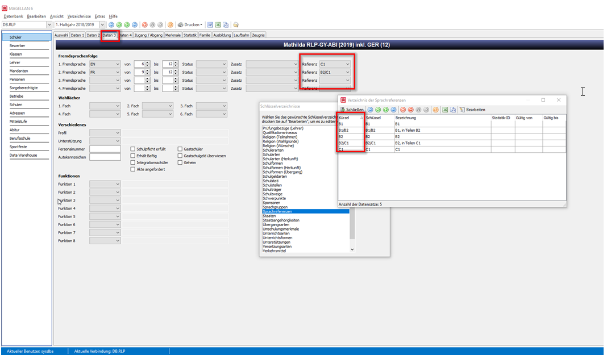

# Was ist neu

Dieses Kapitel gibt ihnen einen Überblick über aktuelle Änderungen in MAGELLAN 6.

Den Änderungsverlauf aus den vergangenen Jahren finden Sie hier: [2018](changelog-2018.md),[2017](changelog-2017.md), [2016](changelog-2016.md), [2015](changelog-2015.md), [2014 und früher](changelog-archive.md).

* Was wir für die nächste Ausgabe planen, sehen Sie im Kapitel ["Voraussichtliche Änderungen"](changelog-next.md).

* [Anleitung zum Einspielen eines Serviceupdate.](installation/update.md)

* [Probleme beim Einspielen des Updates?](installation/probleme-beim-update.md)

## LEGENDE

Abkürzung | Bedeutung
----------|----------
FIX       | Korrektur bestehender Funktionalität
NEW       | Neue Funktionalität
CHANGE    | Änderung des Ablaufs, Verarbeitung oder Bedienung

## Wichtiger Hinweis

> #### danger::Achtung!
>
>
> Bitte beachten Sie, dass unser Support einen Supportvertrag voraussetzt und für die jeweils aktuelle Ausgabe von MAGELLAN gilt, dass ist aktuell MAGELLAN 7.  **Die Unterstützung für MAGELLAN 6 wird Ende des Jahres 2019 eingestellt.**

## Dateien, die per Download angeboten werden

Für MAGELLAN 6 werden keine Aktualisierung mehr angeboten. Letzte geänderte Dateien sind zum Download hinterlegt.

### Berichte 

#### Berlin

[Download](https://my.hidrive.com/share/qptlwhk642)

Ordner | Inhalt
--|--
BS Zeugnisse | Schul Z 500, Schul Z 501, Schul Z 502, Schul Z 503 
BFS Zeugnisse | Schul Z 520, Schul 521, Schul Z 522, Schul Z 523, Schul Z 526
IBA Zeugnisse | Schul Z 590, Schul Z 591, Schul Z 592, Schul Z 593, Schul Z 594
Berechnungsskripte | BER-BBS-Matrix-2016.dws, BER-BFS-Matrix-2016.dws, BER-IBA-HJ-2020.dws, BER-IBA-AS-2020.dws

CHANGE | BS Zeugnisformulare
--|--
BER-Schul Z 500 (09.19).rpt | Rechtschreibfehler BERUFSÜBERGREIFENDER UNTERRICHT
BER-Schul Z 501 (09.19).rpt | Rechtschreibfehler BERUFSÜBERGREIFENDER UNTERRICHT, Ausgabe Wahlb/WahlPF rechte Spalte korrigiert
BER-Schul Z 502 (09.19).rpt | Datum des Gesamtnotendurchschnittes entspricht dem Zeugnisdatum
BER-Schul Z 503 (09.19).rpt | Siegel blau eingefügt, Rechtschreibfehler BERUFSÜBERGREIFENDER UNTERRICHT, im Kopf "Die Leistungen in alle(n) Schulhalbjahren..... hier wurde "n" ergänzt

CHANGE | BFS Zeugnisformulare
--|--
BER-Schul Z 520 (09.19).rpt | verschiedene Korrekturen
BER-Schul Z 521 (09.19).rpt |
BER-Schul Z 522 (09.19).rpt |
BER-Schul Z 523 (09.19).rpt | verschiedene Korrekturen, Kopf "Abschlusszeugnisses der Berufsfachschule"
BER-Schul Z 526 (09.19).rpt | verschiedene Korrekturen

CHANGE | IBA Zeugnisformulare
--|--
BER-Schul Z 590 (12.19).rpt | verschiedene Korrekturen, Zeugnis kann für 1.HJ und 2.HJ als Halbjahreszeugnis genutzt werden
BER-Schul Z 592 (03.20).rpt| verschiedene Korrekturen
BER-Schul Z 593 (10.20).rpt| verschiedene Korrekturen

* FIX: BER-Schul Z 300 (11.19).rpt (Versetzungsvermerk korrigiert, wird ein Schüler nicht versetzt, gibt des Zeugnis "Nicht versetzt...." aus)
* FIX: BER-Schul Z 306 (11.19).rpt (Punktsumme aus 24 Grundkursen in einfacher Wertung korrigiert, wenn eines der Prüfungsfächer BLL oder PRS ist)
* FIX: BER-Schul Z 306 (11.19)(FG).rpt (Punktsumme aus 24 Grundkursen in einfacher Wertung korrigiert, wenn eines der Prüfungsfächer BLL oder PRS ist)
* NEW: BER-Schul Z 251 (11.19).rpt (Schul Z 251 – Zeugnis des Gymnasiums, Jahrgangsstufen 5 und 6 – (11.19), Dieses Zeugnis können Sie auch [hier herunterladen](https://my.hidrive.com/share/obi.po07fi). 

#### Saarland

> #### wichtig::Hinweis!
>
> Die Zeugnisse für Allgemeinbildende Schulen werden Ihnen auch über den [BSCW Server](https://bscw.saarland.de/) bereit gestellt.

* CHANGE: SAR-FHReife (Nachweis)(GOS2.0) Zweitschrift.rpt (Layoutänderungen)
* CHANGE: SAR-FHReife (Nachweis)(GOS2.0).rpt (Layoutänderungen)
  
### Skripte

* NEW: BER-IBA-HJ-2020.dws (Doku unter https://doc.la.stueber.de/03.ber/ber-iba-hj-2020dws/)

* CHANGE: NRW-APO-BK-2012: Abfrage der Unterrichtsart DB/Diff (Doku unter https://doc.la.stueber.de/08.nrw/nrw-apo-bk-2012/)

## 6.5.42 - 674 [11.06.2020]

> #### warning::Wichtig!
>
> Die Datenstruktur von MAGELLAN ist erweitert worden! 
> Bitte aktualisieren Sie als erstes Ihren Serverrechner, anschließend alle Arbeitsplatzrechner! Beim ersten Start von MAGELLAN erfolgt eine automatische Anpassung an die neue Datenstruktur durch einen Assistenten. Eine genaue Anleitung zum Serviceupdate finden Sie [**hier**](https://doc.magellan6.stueber.de/installation/update.html). Sollten Probleme auftreten, schauen Sie bitte [**hier**](https://doc.magellan6.stueber.de/installation/probleme-beim-update.html).
> Bitte denken Sie daran im Anschluss an die Strukturanpassung der Datenbank noch die Zugriffsrechte der Benutzer unter `MAGELLAN ADMINISTRATOR > Datenbankpflege > Datenbank überprüfen > Zugriffsrechte synchronisieren` zu aktualisieren!

### MAGELLAN

* NEW: Neues Notenfeld `Durchschnitt`, dass ermöglicht Noten als Kommawert (Beispiel 1,4) zu erfassen unter `Schüler > Zeugnis`.

### Berichte

Eine Anleitung unserer Berichte finden Sie im Modul MAGELLAN BERICHTE, das Bestandteil der Installation ist und unter `Start > Programme > Stüber Systems > MAGELLAN BERICHTE` aufgerufen werden kann.

#### Berlin (Berufsbildende Schulen)

> #### wichtig::Hinweis!
>
> Die aktuellesten Zeugnisse und Anleitungen zu den Eingaben in MAGELLAN für jedes Zeugnis finden Sie  [hier](https://my.hidrive.com/share/qptlwhk642). Sollten sich nach Einspielen des Updates Korrekturen oder Änderungen ergeben, werden diese dort vorab bereit gestellt.

Ordner | Inhalt
--|--
BS Zeugnisse | Schul Z 500, Schul Z 501, Schul Z 502, Schul Z 503 
BFS Zeugnisse | Schul Z 520, Schul 521, Schul Z 522, Schul Z 523, Schul Z 526
IBA Zeugnisse | Schul Z 590
Berechnungsskripte | BER-BBS-Matrix-2016.dws, BER-BFS-Matrix-2016.dws, BER-IBA-HJ-2020.dws

CHANGE | Zeugnisformular
--|--
BER-Schul Z 500 (09.19).rpt | Ausgabe X. Halbjahr der Berufsschule im Zeugniskopf korrigiert, wenn Ausbildungsbeginn im 2. HJ ist, wird nun das Halbjahr korrekt berechnet, Logo neu eingefügt, lange Fachbezeichnungen im Berufsübergreifenden Bereich sowie Wahlpflicht/Wahlunterricht werden zweizeilig ausgegeben
BER-Schul Z 501 (09.19).rpt | Fußnote 4 wird korrekt ausgegeben, das BIS-Datum für den Besuch des Schülers an der Schule wird aus dem Feld "Zeugnisdatum" im Menü Berufsschule > Matrix gezogen, Entwertungen mittig
BER-Schul Z 502 (09.19).rpt | das BIS-Datum für den Besuch des Schülers an der Schule wird aus dem Feld "Zeugnisdatum" im Menü Berufsschule > Matrix gezoge, alle Datumsangaben nun einheitlich formatiert
BER-Schul Z 503 (09.19).rpt | Logo neu eingefügt, lange Fachbezeichnungen im Berufsübergreifenden Bereich sowie Wahlpflicht/Wahlunterricht werden zweizeilig ausgegeben, Füllwerte o. B., b.f.werden wieder korrekt ausgegeben, Entwertungen mittig, Siegel blau eingefügt

CHANGE | Zeugnisformular
--|--
BER-Schul Z 520 (09.19).rpt | Ausbildungsbetrieb aus Unterschriftsbereich entfernt, Entwertungen alle mittig

* NEW: BER-Schul Z 520 (09.19).rpt
* NEW: BER-Schul Z 521 (09.19).rpt
* NEW: BER-Schul Z 522 (09.19).rpt
* NEW: BER-Schul Z 523 (09.19).rpt
* NEW: BER-Schul Z 526 (09.19).rpt

#### Berlin (Allgemeinbildende Schulen)

* NEW: BER-Schul Z 255 (2019.2020).rpt
* NEW: BER-Schul Z 256 (2019.2020).rpt
* NEW: BER-Schul Z 324 (11.19).rpt
  
#### Saarland

> #### wichtig::Hinweis!
>
> Die Zeugnisse für Allgemeinbildende Schulen werden Ihnen auch über den [BSCW Server](https://bscw.saarland.de/) bereit gestellt.

* NEW: SAR-GEMS-AS (Klasse 9 ohne Prüfung)(ab 2020).rpt
* NEW: SAR-GEMS-AS (Klasse 9 mit Prüfung)(ab 2020).rpt
* NEW: SAR-FHReife (Nachweis)(GOS2.0) Zweitschrift.rpt
* NEW: SAR-FHReife (Nachweis)(GOS2.0).rpt

### Skripte

* NEW: BER-BFS-Matrix-2016.dws (Endnotenberechnung in der Berufsschulmatrix gemäß Berufsfachschulverordnung vom 14.07.2008, in der letzten Fassung vom 28.08.2016 Berlin) Eine Anleitung dazu finden Sie unter https://doc.la.stueber.de/berufsschule/ und https://doc.la.stueber.de/03.ber/ber-bfs-matrix-2016dws/
* CHANGE: NRW-APO-BK-2012 und NRW-APO-2012 Abschaffung der so genannten „Abweichungsprüfungen“, (d.h. verpflichtende mündliche Prüfungen im ersten bis dritten Abiturfach bei einer Abweichung der Prüfungsnote von der Vornote von vier oder mehr Punkten)

## 6.5.41 - 673 (16.04.2020)

### Berichte

#### Berlin

Eine Anleitung zu den Zeugnisse Schul Z 500, Schul Z 501, Schul Z 502 und Schul Z 503 finden Sie unter [Anleitung und Berichte Berliner Berufsschulzeugnisse] (https://my.hidrive.com/share/qptlwhk642). Dort finden Sie auch immer die aktuellsten Berichte. Sollten nach Einspielen dieses Updates noch Änderungen an den Berichten erfolgen, werden diese immer aktuell dort abzurufen sein.

* NEW: BER-Schul Z 500 (09.19).rpt > Schul Z 500 – Zeugnis der Berufsschule – (2 Seiten) – (09.19))
* NEW: BER-Schul Z 501 (09.19).rpt > Schul Z 501 – Abschlusszeugnis der Berufsschule – (3 Seiten) – (09.19)
* NEW: BER-Schul Z 502 (09.19).rpt > Schul Z 502 – Zeugnis der Berufsschule über den mittleren Schulabschluss – (2 Seiten) – (09.19))
* NEW: BER-Schul Z 503 (09.19).rpt > Schul Z 503 – Abgangszeugnis der Berufsschule – (2 Seiten) – (09.19)

* FIX: BER-Schul Z 300 (11.19).rpt (Leerzeichen vor Datumsangabe eingefügt)
* CHANGE: BER-Schul Z 250 (11.19).rpt (es werden nur Wahlpflichtfächer ausgegeben, die eine Note im Feld "Endnote" eingetragen haben, Wahlpflichtfächer ohne Benotung werden nun auch in der Fachbezeichnung entwertet auf dem Zeugnis ausgegeben)
* FIX: BER-Schul Z 306 (11.19)(FG).rpt (Bereich der Zeugnisbemerkungen nun mit variabler Größe)
* FIX: BER-Schul Z 306 (11.19).rpt (Bereich der Zeugnisbemerkungen nun mit variabler Größe)

#### Saarland

Unter ...Magellan\Berichte\Zeugnisse\Saarland\Ministerium finden Sie folgende Zeugnisformulare neu abgelegt. Eine Handout zu den Formularen finden auf dem BSCW-Server http://bscw.saarland.de.

* NEW: SAR-GY-AZ (Klassenstufen 5-10)+GEMS-AZ (Einführungsphase).rpt
* NEW: SAR-GY-AZ (modifiziert Klassenstufen 9 und 10).rpt
* NEW: SAR-GY-HJZ-JZ (Klassenstufen 5-10)+GEMS-HJZ-JZ (Einführungsphase).rpt
* NEW: SAR-GY-Verhaltenszeugnis.rpt
  
### Skripte

* NEW: BER-BBS-Matrix-2016.dws (Das Fach **Sport/Gesundheitsförderung** wird nun bei der Ermittlung des Gesamtnotendurchschnitts berücksichtigt.)
* FIX: DE-DIAP-2015.dws > Vorschlagsautomatik korrigiert (Einbringunsgverpflichtung mind. 2 HJ in Naturwissenschaften, optimale Punktzahl)
* FIX: DE-DIAP-2015.dws > Vorschlagsautomatik für FHR-Berechnung korrigiert, es werden nun die zulässigen 14 Kurse aus 7 Fächern im Vorschlag markiert
* CHANGE: Importiere SDTF.dws (Unterrichtsart-Schlüssel "L" ist hinzugekommen)
* FIX: NRW-APO-2012.dws - Überprüfung für das Fach Musik, ob mehr als 5 Kurse eingebracht wurden für den Fall: dass ein Schüler Musik außerhalb des Abiturbereiches belegt, es können von den 5 möglichen eingebrachten Grundkursen auch max. zwei instrumental- oder vokalpraktischen Kurse sein

## 6.5.40 - 673 (19.12.2019)

### Berichte

Eine Anleitung unserer Berichte finden Sie im Modul MAGELLAN BERICHTE, das Bestandteil der Installation ist und unter `Start > Programme > Stüber Systems > MAGELLAN BERICHTE` aufgerufen werden kann.

* FIX: Schülerpersonalblatt (mit Vorbildung).rpt
* FIX: DAS-GY-AZ mit FHR (Anlage 9b).rpt

#### Berlin

* NEW: BER-Schul Z 620 (09.18).rpt (Beiblatt zum Zeugnis für ergänzende Bemerkungen (09.18), Bitte beachten Sie, dass Sie dieses Formular gesondert ausgedruckt werden muss. Die Zeugnisbemerkung muss in MAGELLAN das Merkmal "Beiblatt" erhalten)

Folgende Berichte wurden um den Bemerkungstext zum Beiblatt Schul Z 620 ergänzt.

* NEW: BER-Schul Z 250 (11.19).rpt
* NEW: BER-Schul Z 351 (11.19)_Oberstufe.rpt
* NEW: BER-Schul Z 351 (11.19)_Kolleg.rpt
* NEW: BER-Schul Z 306 (11.19)(FG).rpt
* NEW: BER-Schul Z 306 (11.19).rpt
* NEW: BER-Schul Z 301 (11.19).rpt
* NEW: BER-Schul Z 300 (11.19).rpt
* NEW: BER-Schul Z 302 (11.19).rpt
* NEW:  BER-Schul Z 303 (11.19).rpt

> #### danger::Achtung!
>
> Die Ausgabe des Bemerkungstextes: "Ein Beiblatt (Schul Z 620) ist Bestandteil dieses Zeugnisses:     ☐ ja     ☐ nein1)." wird wie folgt gesteuert:
Liegt eine Zeugnisbemerkung mit dem Merkmal "Beiblatt" beim Schüler vor, kommt der Text in der Bemerkung: “Ein Beiblatt (Schul Z 620) ist Bestandteil dieses Zeugnisses.” 
Liegt dieses Merkmal nicht vor, kommt der Text in der Bemerkung: “Ein Beiblatt (Schul Z 620) ist nicht Bestandteil dieses Zeugnisses.”

## 6.5.39 - 673 (20.08.2019)

### MAGELLAN

* FIX: Anzeige der Statistiklizenz 2019 (RLP) unter `Hilfe > Lizenz` korrigiert

### Importe

* FIX: RLP_AS_SchuelerMerkmale.keys und RLP_AS_Faecher.keys

## 6.5.38 - 673 (12.08.2019)

### MAGELLAN

* FIX: Anpassung im Skript "Schüler korrigieren.dws" [Falls Sie es nicht schon für das letzte Update druchgeführt hatten: Bitte führen Sie im MAGELLAN Administrator den Punkt `Datenbankpflege > Datenbank überprüfen > Zugriffsrechte synchronisieren` aus, die Nutzer sollten sich im Anschluss bitte einmal neu anmelden.]

### Statistik

* NEW: Rheinland-Pfalz Statistikmodul 2019. Beachten Sie bitte die aktualisierten Schlüsselverzeichnisse. Bitte beachten Sie die aktualisierte [Statistikdokumentation](https://doc.ls.stueber.de/rheinland-pfalz/abs-bbs/) für RLP.

## 6.5.37

* nicht veröffentlicht

## 6.5.36 - 673 (19.07.2019)

### Skripte

* FIX: `Zuweisen von Kategorietafeln` korrigiert
* FIX: `Benutzerrechte zuweisen` und `Zugriffsrechte synchronisieren` korrigiert [Bitte führen Sie im MAGELLAN Administrator den Punkt `Datenbankpflege > Datenbank überprüfen > Zugriffsrechte synchronisieren` aus, die Nutzer sollten sich im Anschluss bitte einmal neu anmelden.]

## 6.5.35 - 673 (01.07.2019)

> #### warning::Wichtig!
>
> Die Datenstruktur von MAGELLAN ist erweitert worden! 
> Bitte aktualisieren Sie als erstes Ihren Serverrechner, anschließend alle Arbeitsplatzrechner! Beim ersten Start von MAGELLAN erfolgt eine automatische Anpassung an die neue Datenstruktur durch einen Assistenten. Eine genaue Anleitung zum Serviceupdate finden Sie [**hier**](https://doc.magellan6.stueber.de/installation/update.html). Sollten Probleme auftreten, schauen Sie bitte [**hier**](https://doc.magellan6.stueber.de/installation/probleme-beim-update.html).
> Bitte denken Sie daran im Anschluss an die Strukturanpassung der Datenbank noch die Zugriffsrechte der Benutzer unter `MAGELLAN ADMINISTRATOR > Datenbankpflege > Datenbank überprüfen > Zugriffsrechte synchronisieren` zu aktualisieren!

### MAGELLAN

* FIX: Beim Update wird die audit.conf nicht mehr ersetzt
* FIX: Die Rechte für den Assistenten `Extras > Schüler korrigieren` wurden angepasst (Bitte Zugriffsrechte synchronisieren!)
* FIX: Ergebnisfenster des Assistenten `Extras > Schüler korrigieren` bleibt geöffnet
* FIX: Die Rechte für die Nutzung der ENBREA-Leistungen wurden analog der Kollegiumsrechte für `Schüler > Zeugnis > Fächer/Leistungen` eingefügt
* CHANGE: Beim Assistenten `Klassen > Bearbeiten > Schuljahreswechsel` werden auch die Einträge für ENBREA-Leistungen für die neuen Klassen übernommen.
* NEW: Neue Nachrichtenfunktion: Die MAGELLAN-Willkommensseite wurde neu gestaltet und enthält jetzt zu den wichtigsten Aufrufen (Dokumentation, Newsletter, Ticketsystem usw.) einen Nachrichtenbereich, über den wir Sie auf dem Laufenden halten werden. Sie erhalten diesen Überblick beim Aufruf von MAGELLAN, des MAGELLAN ADMINISTRATORs und der MAGELLAN BIBLIOTHEK.

### Skripte

* CHANGE: `Benutzerrechte zuweisen.dws` Rechte für ENBREA-Leistungen ergänzt
* CHANGE: `Synchronisiere Zugriffsrechte.dws` Rechte für ENBREA-Leistungen ergänzt

### Berichte (neu oder geändert)

Eine Anleitung unserer Berichte finden Sie im Modul MAGELLAN BERICHTE, das Bestandteil der Installation ist und unter `Start > Programme > Stüber Systems > MAGELLAN BERICHTE` aufgerufen werden kann.

* CHANGE: RLP-GY-AZ (2016).rpt (hinter den Fremdsprachen wird das Sprachniveau in Klammern ausgegeben)

* CHANGE: RLP-GY-AZ (7-10).rpt _(hinter den Fremdsprachen wird das Sprachniveau in Klammern ausgegeben)_
* CHANGE:  Skript BER-APO-2017.dws,  Prüfung auf mehr als 3 Seminarkurse
* CHANGE: DAS-Prüfungsbogen (Anlage 7 zu DIA-PO)(2018).rpt (Unterrichtssprachen)

#### Berlin

* CHANGE: BER-Schul Z 306 (11.18).rpt _(Fußnote 1) bei den Fremdsprachen gemäß Vorlage geändert, Text "Freibleibende Felder sind zu entwerten" ergänzt, Ausgabe "Punkte in einfacher Summe" für die 5 Prüfungskomponente korrigiert)_
* CHANGE: BER-GY (Abi-18a - Mitteilungen zu den schriftlichen und mündlichen Prüfungen)(03.12).rpt _(Ausgabe "Punkte in einfacher Summe" und "Note" für die 5 Prüfungskomponente korrigiert, Ausgabe der Punkte in einfacher Summe für die 5 Prüfungskomponente auf Seite 2/Rückseite korrigiert)_
* NEW: BER-Schul Z 255 (10.18).rpt _(Schul Z 255 – Zeugnis des Gymnasiums über die erweiterte Berufsbildungsreife (10.18))_

## 6.5.34 - 672 (28.05.2019)

> #### warning::Wichtig!
>
> Die Datenstruktur von MAGELLAN ist erweitert worden!   
> Bitte aktualisieren Sie als erstes Ihren Serverrechner, anschließend alle Arbeitsplatzrechner! Beim ersten Start von MAGELLAN erfolgt eine automatische Anpassung an die neue Datenstruktur durch einen Assistenten. Eine genaue Anleitung zum Serviceupdate finden Sie [**hier**](http://doc.magellan6.stueber.de/installation/serviceupdates.html). Sollten Probleme auftreten, schauen Sie bitte [**hier**](http://doc.magellan6.stueber.de/installation/troubleshootingupdate.html).

### Skripte

Eine Anleitung für alle unsere Berechnungsskripte finden Sie in der Dokumentation [MAGELLAN Landesanpassungen](https://doc.la.stueber.de).  
Hinweis für angepasste Skriptdateien: Mit der MAGELLAN-Version 6.5 wurde der Skriptingmechanismus auf eine neue Version aktualisiert. Welche Änderungen für von Schulen angepasste Skripte notwendig sind, beschreiben wir hier: [https://doc.magellan-scripting.stueber.de/anderungen.html](https://doc.magellan-scripting.stueber.de/anderungen.html)

* CHANGE: 
* FIX: Synchronisiere Mittelstufe.dws
* FIX: BER-APO-2017.dws
* FIX: NRW-APO-BK-2012.dws
* CHANGE: SHL-APO-2018.dws (GER-Niveau wird nun NEU vom Skript berechnet, lesen Sie dazu folgenden [Abschnitt](https://doc.la.stueber.de/Skripte/SAR-APO-2018.html))

### Berichte \(neu oder geändert\)

Eine Anleitung unserer Berichte finden Sie im Modul MAGELLAN BERICHTE, das Bestandteil der Installation ist und unter `Start > Programme > Stüber Systems > MAGELLAN BERICHTE` aufgerufen werden kann.

* CHANGE: DAS-GY-ABI \(DIA\)\(2019\).rpt (_Layoutänderungen, KMK Logo auf Deckblatt eingebaut_)
* CHANGE: BAW-BG-ABI \(DIN A4 doppelseitig 2018\).rpt
* CHANGE: SAC-BG-ABI \(E.01.06\).rpt  \(_Layoutänderungen\)_
* NEW: NRW-BK-ABI \(Anlage D41\)\(2018\)\(GeR\).rpt \(_Anlage D 41, Zeugnis der Allgemeinen Hochschulreife - Niveau gemäß GER eingebaut, zum Erfassen der Niveaustufen lesen Sie bitte folgenden Artikel in der MAGELLAN 6 Knowledge Base: _[https://doc.magellan6-kb.stueber.de/sprachreferenzen.html](https://doc.magellan6-kb.stueber.de/sprachreferenzen.html) \)
* FIX: NIE-GY (Studienbuch - Einführungsphase) G9.rpt _(vor einstellige Punktzahlen wird nun eine Null vorangestellt)_
* FIX: SHL-GY-ABI (2018).rpt _(vor einstellige Punktzahlen wird nun eine Null vorangestellt)__

#### Berlin

* CHANGE: BER-Schul Z 306 \(11.18\).rpt \(_Positionierung der Fächer angepasst, Für die Sortierung der Fächer auf den Zeugnissen muss im Menü "Schüler" bei jedem Schüler auf der Registerkarte "Zeugnis\|Fächer" bzw. im Menü "Abitur"  bei jedem Schüler auf der Registerkarte "Qualifikation" pro Fach eine Position in der Spalte "Position" angegeben werden. Die Ausgabe der Fächer auf dem Zeugnis entspricht dieser Sortierung. _\)
* CHANGE: BER-GY \(abi\_4\_berechnungsbogen\)\(10.16\).rpt \(_Layoutänderungen_\)
* NEW: BER-Schul 5 256 (10.18).rpt (_Schul Z 256 – Zeugnis des Gymnasiums über den mittleren Schulabschluss (10.18)_)

> #### danger::Achtung!
>
> * SERIENDRUCK: Wir übergeben für den Seriendruck fest an Word die Zeichencodierung als UTF8. 
> Wenn Sie in der Registry einen Schlüssel gesetzt hatten, der Umlauteproblem von Word lösen sollte, muss dieser Schlüssel (der den Zeichensatz 1252 vorgibt) wieder entfernt werden! 
> Artikel: ["Word stellt Umlaute nicht korrekt dar"](https://doc.magellan6-kb.stueber.de/seriendruck/umlaute.html)
>
> * RUNTIME-ERROR: Einige Benutzer, die von älteren Versionen umsteigen, können MAGELLAN im Anschluss nicht starten. Meist ist die Ursache, dass eine der Dateien, die beim Programmstart geladen werden, beschädigt ist. 
>   Sie finden hier eine [Anleitung](https://doc.magellan6.stueber.de/installation/probleme-beim-update.html#meldung-runtime-error-) um dieses Problem zu beheben.

---
## 6.5.33 - 671 (16.04.2019)

### MAGELLAN ADMINISTRATOR

* CHANGE: `Datenbank überprüfen > Anrede setzen` \(Aktion wird ausgeführt, wenn die Anrede leer, F oder H ist\)

### Skripte

Eine Anleitung für alle unsere Berechnungsskripte finden Sie in der Dokumentation [MAGELLAN Landesanpassungen](https://doc.la.stueber.de).  
Hinweis für angepasste Skriptdateien: Mit der MAGELLAN-Version 6.5 wurde der Skriptingmechanismus auf eine neue Version aktualisiert. Welche Änderungen für von Schulen angepasste Skripte notwendig sind, beschreiben wir hier: [https://doc.magellan-scripting.stueber.de/anderungen.html](https://doc.magellan-scripting.stueber.de/anderungen.html)

* CHANGE: NRW-APO-2012.dws \(Problem in der Vorschlagsautomatik korrigiert\)
* FIX: RLP-APO-2014.dws: Vorschlag für Musik als freiwilliges Fach korrigiert.
* CHANGE: NRW-APO-BK-2012.dws: Mit der Ausgabe dieses Skriptes werden beim Initialisieren nur noch Kurse berücksichtigt, die mit einer der nachstehenden Unterrichtsart markiert sind. Durch diese Änderung werden gezielt Kurse von der Berücksichtigung im Abitur ausgeschlossen. In den Fachdaten erfasste Zeilen, die beispielsweise das Arbeits- und Sozialverhalten beinhalten, bleiben so außen vor.

| Kürzel | Schlüssel | Bedeutung |
| --- | --- | --- |
| LK | LK | Leistungskurs  \(LK wird für das Abitur und die Fachhochschulreife, nicht durch Unterrichtsart sondern durch Fachstatus "1PF/2PF" identifiziert.\) |
| GK | GK | Grundkurs \(GK wird für das Abitur und die Fachhochschulreife, nicht durch Unterrichtsart sondern durch nicht erfolgten Eintrag der Fachstatus "1PF/2PF" identifiziert.\) |
| DB | DB | Die Unterrichtsart kann verwendet werden, damit die Kursergebnisse beim Initialisieren mit einbezogen werden. |
| BU | BU | Die Unterrichtsart kann verwendet werden, damit die Kursergebnisse beim Initialisieren mit einbezogen werden. |
| BÜ | BÜ | Die Unterrichtsart kann verwendet werden, damit die Kursergebnisse beim Initialisieren mit einbezogen werden. |

#### BER-APO-2017.dws

* FIX: wenn Biologie als einziges naturwissenschaftiches Fach durchgängig belegt wurde, wird nun richtig geprüft, dass auch in Physik oder Chemie zwei Kurse belegt und eingebracht werden müssen \(VO-GO §25\)
* FIX: wenn Sport als 4. oder 5. PF gewählt ist, wird nun richtig der letzte Kurs Sporttheorie eingebracht sowie 3 Praxiskurse Sport \(ein weiterer Sportkurs \(Praxis oder Theorie\) kann zusätzlich eingebracht werden
* FIX: Vorschlag berücksichtigt nun auch Folgendes: für das 5. PF gilt \(außer Sport\) - nur der letzte Kurs muss eingebracht werden, wenn die Belegverpflichtunganderweitig im gleichen Aufgabenfeld erfüllt wurde

#### DE-DIAP-2015.dws

* CHANGE: Vorschlagsautomatik optimiert
* NEW: Ermittlung einer Schnittverbesserung durch mögliche Einbringung einer mdl. Note 

* NEW: Ermittlung der Abiturzulassung am Ende der Q3 wenn unter dem Menü ``Abitur > Qualifikation`` in den Feldern ``Q4`` keine Punktwerte eingetragen sind

#### DE-MSA-2019.dws

* NEW: Neues Berechnungsskript für die Durchschnittsberechnung MSA für Auslandsschulen gemäß Ordnung für den Abschluss der Sekundarstufe I an Deutschen Schulen im Ausland vom 16.03.2017 im Menü `Schüler > Zeugnis > Leistungen`. 
Bitte bitte lesen Sie dazu den Abschnitt der Landesanpassung [DE-MSA-2019](https://doc.la.stueber.de/durchschnitt_abschluss/de-msa-2019dws.html)

### Berichte \(neu oder geändert\)

Eine Anleitung unserer Berichte finden Sie im Modul MAGELLAN BERICHTE, das Bestandteil der Installation ist und unter `Start > Programme > Stüber Systems > MAGELLAN BERICHTE` aufgerufen werden kann.

* FIX: RLP-GY-AZ (2016).rpt (Bericht optimiert, damit allen Angaben auf einer Seite ausgegeben werden)
* FIX: BER \(Kurswahl\).rpt \(Anzahl der auszugegebenen Fächer unter Aufgabenfeld 2 um zwei Fächer erweitert\)
* NEW: Klassenliste mit Schülersummendaten Ausländer.rpt
* FIX: BER-Schul Z 302 (10.18).rpt (Ausgabe der Fächer im Bereich "weitere Fächer" korrigiert)

#### DAS-Zeugnisse

* CHANGE: DAS-Versetzungszeugnis-GY-MSA (ZKA)(Anlage 11)(§23).rpt |personalisierte Zeugnisbemerkungen |
* FIX: DAS-HS-MSA-AS (Anlage 8 und 9)(§23).rpt |Ausgabe der mdl. Noten, es werden alle eingetragenen Fächer mit einer mdl. Note ausgegeben, Ausgabe Notendurchschnitt korrigiert|
* FIX: DAS-ZZ (Q-Phase)(Anlage 1)(RiLi 1.6).rpt | personalisierte Zeugnisbemerkungen|
* NEW: DAS-GY-ABI (DIA)(2019).rpt | +++Abiturzeugnis+++ bitte verwenden Sie dieses Zeugnis für den Druck des Abiturzeugnisses 2019 gemäß Anlage 7 anstatt des Berichtes _DAS-GY-ABI (Anlage 7).rpt_|
* FIX:  DAS-Zeugnis Gymnasium - Mittlerer Schulabschluss (Anlage 10)(§23).rpt | Ausgabe der mdl. Noten, es werden alle eingetragenen Fächer mit einer mdl. Note ausgegeben, Ausgabe Notendurchschnitt korrigiert|

> #### primary::Hinweis
>
> Bitte tragen Sie im Verzeichnis ``Fächer`` in der Spalte "Merkmal" für die Fächer Deutsch, Englisch, Mathematik und die Landessprache die nachstehend Kürzel ein. Aus diesen Kürzeln ergeben sich die Fächer auf erhöhtem Anforderungsniveau. Zudem wird in einigen Berichten durch dieses Fachmerkmal geklammert ein (E) hinter der Fachbezeichnung ausgegeben.

| Fach (Bezeichnung/Kürzel) | Merkmal |
|---------------------------|---------|
| -                         | -       |
| Deutsch                   | D       |
| Mathematik                | M       |
| Englisch                  | E       |
| Landessprache             | LS      |

## 6.5.32 - 671 (01.02.2019)

### MAGELLAN

* FIX: Problem beim Versetzen von Schülern in einen anderen Mandanten behoben, für jeden Schüler wird seine Herkunftsschule in den anderen Mandanten übernommen.
* FIX: Problem beim Kopieren von Schülern in parallelen Mandanten mit Merkmalen (umbenannte Merkmale mit Leerzeichen in der Umbenennung)behoben
* FIX: Neu eingestellte aktuelle Ausbildung wird gespeichert vor Kartenwechsel (Problem trat bei Wechsel auf Merkmale auf)
* NEW: Beim Import von Schülern/Bewerbern aus SchülerOnline (NRW) wird aus dem Geschlecht (m/w) automatisch die Anrede(Herr/Frau) vorbefüllt.

### MAGELLAN ADMINISTRATOR

* FIX: Text unter `Datenpflege > Datenbank überprüfen > Abiturdetails korrigieren` korrigiert
* NEW: Unter `Datenpflege > Datenbank überprüfen > Anrede setzen` gibt es die Möglichkeit für Schüler/Bewerber/Lehrer/Personen, die bislang keine Anrede hatten, die Anrede (Herr/Frau) anhand der Auswahl des Geschlechts (m/w) zuzuweisen. [Dokumentation hier](https://doc.magellan6.stueber.de/admin/db-connection.html#datenbank-%C3%BCberpr%C3%BCfen)
* NEW: Unter `Datenpflege > Datenbank überprüfen > Schüler-Passfoto löschen` können Sie alle Passbilder der inaktiven Schüler aus der Datenbank (aller Schüler, aller Zeiträume, aller Mandanten) entfernen. Die Größe der Datenbank reduziert sich nach dem Sichern und Wiederherstellen Ihrer Datenbank. [Dokumentation hier](https://doc.magellan6.stueber.de/admin/db-connection.html#datenbank-%C3%BCberpr%C3%BCfen)

### Skripte

Eine Anleitung für alle unsere Berechnungsskripte finden Sie in der Dokumentation [MAGELLAN Landesanpassungen](https://doc.la.stueber.de).  
Hinweis für angepasste Skriptdateien: Mit der MAGELLAN-Version 6.5 wurde der Skriptingmechanismus auf eine neue Version aktualisiert. Welche Änderungen für von Schulen angepasste Skripte notwendig sind, beschreiben wir hier: [https://doc.magellan-scripting.stueber.de/anderungen.html](https://doc.magellan-scripting.stueber.de/anderungen.html)

* CHANGE: NRW-APO-BK-2012.dws: Beim Initialisieren und beim Vorschlag werden nur Zeilen berücksichtigt, die die Unterrichtsarten `GK`, `LK` oder `DB` haben. Sollten Sie weitere Fächer in der Abiturqualifikationskarte haben (beispielsweise Ergebnisse des Arbeits- und Sozialverhaltens), werden diese nicht für die Abiturqualifikation berücksichtigt.
* CHANGE: MVP-APO-2017.dws: kleine Korrekturen

### Berichte \(neu oder geändert\)

Eine Anleitung unserer Berichte finden Sie im Modul MAGELLAN BERICHTE, das Bestandteil der Installation ist und unter `Start > Programme > Stüber Systems > MAGELLAN BERICHTE` aufgerufen werden kann.

* NEW: NIE-GY (Studienbuch - Einführungsphase) G9.rpt _(zweite Seite des Studienbuches, Einführungsphase)_
* NEW: BER-Schul Z 250 (10.18).rpt _(Schul Z 250 – Zeugnis des Gymnasiums, Jahrgangsstufen 7 bis 10, optional Jahrgangsstufen 5 und 6 – (10.18))_
* NEW: SAC-BS-AS (Vorbereitungsklasse) (A.01.06)(2019).rpt _(Zeugnis der Berufsschule Vorbereitungsklasse)_
* NEW: SAC-BS-HJI (A.01.02)(2019).rpt _(Halbjahresinformation der Berufsschule Vorbereitungsklasse))_

#### Sachsen

In folgenden Berichten wurde das Wort „SchulG“ durch das Wort „SächsSchulG“ (gemäß VwV Zeugnisse berufsbildende Schulen vom 05.11.2018) ersetzt:
* CHANGE: SAC-BS-BVB Maßnahme (A.01.05).rpt 
* CHANGE: SAC-BVJ-AS mit HS (A.01.08).rpt
* CHANGE: SAC-BVJ-AS ohne HS (A.01.09).rpt
* CHANGE: SAC-BVJ-AS ohne HS (A.01.10).rpt
* CHANGE: SAC-BGJ-AS ohne HS (A.01.11).rpt
In folgenden Berichten wurde die Angabe „Personensorgeberechtigte/r“ durch das Wort „Eltern“ ersetzt.
* CHANGE: SAC-BF-HJI (B.01.01).rpt
* CHANGE:SAC-BS-JZ (A.02.01).rpt
* CHANGE: SAC-FOS-HJZ (D.01.01).rpt
* CHANGE: SAC-FOS-JZ (D.01.02).rpt
* CHANGE: SAC-BG-HJZ (E.01.01).rpt
* CHANGE: SAC-BG-JZ (E.01.02).rpt
* CHANGE: SAC-BG-HJZ (E.01.03).rpt
* CHANGE: SAC-BG-HJZ (E.01.04).rpt

#### Berlin
* NEW: BER-Schul Z 250 (10.18).rpt

## 6.5.31 - 671 (18.01.2019)

### MAGELLAN

* CHANGE: Änderung im Seriendruck, die Zeichencodierung wird fest als UTF8 von MAGELLAN übergeben, WORD hat in einigen Ausgaben ein Problem ab einer bestimmten Menge von Datensätzen die Zeichencodierung korrekt zu erkennen.

### Importe

* FIX: SAC-BS_Bildungsgaenge.keys: In der Spalte `Bezeichnungen` wurden die vorangestellten Schlüsselnummern entfernt.

### Skripte

Eine Anleitung für alle unsere Berechnungsskripte finden Sie in der Dokumentation [MAGELLAN Landesanpassungen](https://doc.la.stueber.de).  
Hinweis für angepasste Skriptdateien: Mit der MAGELLAN-Version 6.5 wurde der Skriptingmechanismus auf eine neue Version aktualisiert. Welche Änderungen für von Schulen angepasste Skripte notwendig sind, beschreiben wir hier: [https://doc.magellan-scripting.stueber.de/anderungen.html](https://doc.magellan-scripting.stueber.de/anderungen.html)

* FIX: DE-DIAP-2015.dws: Fehler bei Summierung im Bereich 4 behoben.
* FIX: NRW-APO-2012.dws Fehler bei der Einbringung der Defizitkurse behoben
* CHANGE: NRW-APO-BK-1999.dws - Ausgabe verbessert
* FIX: NRW-AS-APO.BK-1999.dws - Korrektur 

### Berichte \(neu oder geändert\)

Eine Anleitung unserer Berichte finden Sie im Modul MAGELLAN BERICHTE, das Bestandteil der Installation ist und unter `Start > Programme > Stüber Systems > MAGELLAN BERICHTE` aufgerufen werden kann.

* CHANGE: Betrifft alle Berichte: Die Berichtsdateien wurden vorbereitet, um für einen ggfs. parallelen Einsatz von Version 7 verwendbar zu sein, alte Berichte wurden dabei teilweise in Archivverzeichnisse verschoben.
* CHANGE: DAS-GY-ABI \(Anlage7\).rpt / Layoutanpassungen, Ausgabe des Jahrganges bei den Fremdsprachen ergänzt
* CHANGE: Schüler (Anzahl Schüler je Herkunftsschulen).rpt 
* CHANGE: Klassenliste (inklusive Zusatzklasse).rpt
* CHANGE: Unfallanzeige.rpt
* NEW: DAS-Übersicht über Prüfungsfächer Abitur \(Anlage 6\).rpt
* NEW: Schülerliste mit Integrationsstatus.rpt | Diese Liste gibt nur Schüler mit Integrationsstatus gruppiert nach Klassen aus.
* CHANGE: BER-Schul Z 510 (12.13).rpt | Ausgabe Fachbezeichnung **Sport/Gesundheitsförderung** korrigiert

#### Rheinland-Pfalz

In folgenden Zeugnissen wurde die Ausgabe des erreichten Niveaus auf der Grundlage des "Gemeinsamen Europäischen Referenzrahmens für Sprachen" (GER) eingebaut bzw. das Deckblatt aktualisiert. Bitte tragen Sie unter `Daten 3 > Fremdsprachenfolge` im Feld `Referenz` das Referenzniveau der Fremdsprache ein. Grundlage bildet das `Verzeichnis > weitere Schlüsselverzeichnisse > Sprachreferenzen`. Vom Bericht wird das Kürzel abgefragt. Eine Klammer wird nur bei vorhandenem GER Niveau ausgegeben. D.h. wenn in Daten3 Referenzniveau eingetragen ist, wird die Fremdsprache ohne Klammer ausgegeben. Z.B. "Latein", "Englisch", "Englisch (B1)", ...

| Kürzel | Schlüssel | Bezeichnung      |
|--------|-----------|------------------|
| B1     | B1        | B1               |
| B1/B2  | B1/B2     | B1, in Teilen B2 |
| B2     | B2        | B2               |
| B2/C1  | B2/C1     | B2, in Teilen C1 |
| C1     | C1        | C1               |

* CHANGE: RLP-BG-ABI (2018)(inkl.GER).rpt
* CHANGE: RLP-GY-ABI (2018-G8-G9)(inkl.GER).rpt
* CHANGE: RLP-GY-ABI (2018-G8-G9)(A4 Seite 1).rpt
* CHANGE: RLP-GY-ABI (2018-G8-G9)(A4 Seite 2)(inkl.GER).rpt
* CHANGE: RLP-GY-ABI (2018-G8-G9)(A4 Seite 1)(ohne Wappen).rpt
* CHANGE: RLP-BG-ABI (2018)(inkl.GER)A4.rpt
* CHANGE: RLP-BG-ABI (inkl.GER).rpt
* CHANGE: RLP-BG-ABI (inkl.GER)A4.rpt

#### Berlin

_Die Zeugnisse sind für G8/G9 Schulen ausgelegt._

* NEW: BER-Schul Z 300 (10.18).rpt
* NEW: BER-Schul Z 301 (11.18).rpt
* NEW: BER-Schul Z 302 (10.18).rpt
* NEW: BER-Schul Z 303 (10.18).rpt
* NEW: BER-Schul Z 306 (11.18).rpt
* NEW: BER-Schul Z 351 (10.18)_Kolleg.rpt
* NEW: BER-Schul Z 351 (10.18)_Oberstufe.rpt 

