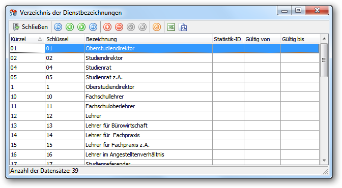

# Datenbank vorbereiten

Dieses Kapitel beschreibt die grundlegenden vorbereitenden Schritte für die Arbeit mit MAGELLAN. Das Erstellen einer neuen Datenbank kann nur vom Administrator durchgeführt werden. Weitere Detailinformationen zur Administration von MAGELLAN finden Sie im Kapitel Administration.

## MAGELLAN starten

Klicken Sie auf `Start > Programme > STÜBER SYSTEMS > MAGELLAN 6`. Die MAGELLAN-Datenbank ist grundsätzlich kennwortgeschützt. Wenn Sie MAGELLAN bzw. den MAGELLAN-Administrator starten, müssen Sie in einem Anmeldedialog Ihre Benutzerkennung und Ihr Kennwort angeben.
 

Der Standardbenutzer lautet „sysdba“ und das dazugehörige Standardkennwort lautet „masterkey“. Mit dieser Standardkennung sind volle Administrationsrechte verbunden. Weitere Informationen zur Anlage und Editierung von Benutzerkennungen und den damit verbundenen Rechten finden Sie im Kapitel [„Benutzerverwaltung“](https://doc.magellan6.stueber.de/admin/users.html).

## Datenbank neu erstellen
 

Wenn Sie MAGELLAN zum ersten Mal aufrufen, ist eine Beispieldatenbank installiert. Sie müssen diese Datenbank leeren und vorbereiten, um Ihre eigenen Daten eingeben zu können. 

1. Verlassen Sie dazu MAGELLAN und starten Sie den MAGELLAN-Administrator, indem Sie auf `Start` und dann auf `Programme > STÜBER SYSTEMS > MAGELLAN 6 Administrator` klicken. 

2. Sie müssen sich im Anmeldedialog als Administrator anmelden. Geben Sie dazu als Benutzer „sysdba“ und Ihr Administratorenkennwort ein. 

3. Klicken Sie im MAGELLAN-Administrator auf `Ansicht > Datenbankpflege` und dann auf `Datenbankinhalt löschen`. Vor dem eigentlichen Löschen werden Sie noch gefragt, ob Sie das Postleitzahlenverzeichnis bzw. die Schlüsselverzeichnisse  (ab MAGELLAN 6.5 wird nach Benutzern oder Zeiträumen gefragt)beibehalten wollen, wobei alles für den Echteinsatz von MAGELLAN  werden sollten. 
Der MAGELLAN-Administrator leert die Datenbank und setzt anschließend alle IDs per "Generatoren synchronisieren" zurück. Damit erhält zum Beispiel der erste neu eingetragene Schüler in Ihrer Datenbank die ID "1".

> #### danger::Achtung!
>
> Ab der Version MAGELLAN 6.5 gibt es das Angebot beim Löschen des Datenbankinhaltes die Benutzer und/oder Zeiträume behalten zu können, bitte löschen Sie auch diese Informationen mit.

## Postleitzahl- und Schlüsselverzeichnisse importieren

Nachdem Sie eine leere Datenbank erstellt haben, sollten Sie die bundeslandspezifischen Schlüsselverzeichnisse und das Postleitzahlverzeichnis importieren. Die Schlüsselverzeichnisse beinhalten je nach Bundesland und Schulart die für die Statistik vorgeschriebenen möglichen Schlüssel. 

> #### primary::Hinweis
>
> Möchten Sie eigene Werte in Schlüsselverzeichnisse importieren, können Sie die Importdateien auch editieren. Lesen Sie dazu bitte den Abschnitt ["Administration > Importe und Exporte > Eigene oder mitgelieferte Schlüsselverzeichnisse importieren"](https://doc.magellan6.stueber.de/admin/import-export.html#eigene-oder-mitgelieferte-schlüsselverzeichnisse-importieren)!

Das Postleitzahlverzeichnis beinhaltet alle deutschen Postleitzahlen inkl. der bundesweit eindeutigen Gemeindeschlüssel und dem Bankleitzahlverzeichnis. Wenn Sie das Postleitzahlverzeichnis importieren, können Sie die automatische Zuordnung von Postleitzahl zu einem Ort bzw. Ort zu einer Postleitzahl nutzen. 

1. Klicken Sie auf `Ansicht > Datenimporte` und dann auf `Schlüsselverzeichnisse importieren` bzw. auf `Postleitzahlen importieren`, um das jeweilige Verzeichnis zu importieren. 

2. Wählen Sie für den Import der Schlüsselverzeichnisse Ihr Bundesland, Ihren Mandanten und Ihren Schultyp und klicken auf `Fertigstellen`. Beim Import des Postleitzahlverzeichnisses muss nur die Datenquelle angegeben werden, diese ist aber in der Regel durch die Pfadangaben während der Installation voreingestellt.

3. Anschließend können Sie MAGELLAN starten und mit der Eingabe wichtiger Grunddaten in MAGELLAN beginnen.
  
  

> #### primary::Hinweis
>
> Sie können im Assistenten „Importiere Schlüsselverzeichnisse/Kataloge“ im Feld „Importiere folgenden Katalog“ auch einzelne Kataloge zum Import auswählen.

> #### primary::Hinweis
>
> Der Assistent liest Postleitzahlen, Bezirke, Kreise, Bundesländer, Gemeindeschlüssel, Banken und für die Auswahl „Berlin“ auch Stadtbezirke ein.

## Bankenverzeichnis importieren

Sie können das Verzeichnis der Banken auch getrennt einlesen. Dazu gehen Sie im MAGELLAN-Administrator wie folgt vor:

1. Klicken Sie auf `Ansicht > Datenimporte` und dann auf `Postleitzahlen importieren`. 

2. Wählen Sie unter `Import für folgendes Land` dort dazu importierende Land aus.

3. Wählen Sie unter `Importiere` folgenden Katalog den Wert `Banken` aus und klicken Sie dann auf `Fertigstellen`.

> #### primary::Hinweis
>
> Im Rahmen der Änderung im Zahlungsverkehr ab 2014 müssen Sie im Bankenverzeichnis auch den BIC-Wert der jeweiligen Bank berücksichtigten. Durch das erneute Einlesen nur des Bankenverzeichnisses können Sie Ihr bisheriges Bankenverzeichnis um den BIC-Wert ergänzen.

## Schlüsselverzeichnisse editieren

In MAGELLAN finden Sie zwei verschiedene Arten von Formularfeldern. Die einen sind frei auszufüllen (z.B. der Name), bei den anderen wurde eine Tabelle hinterlegt (z.B. Konfessionen), aus denen Sie Einträge auswählen müssen. Diese Tabellen heißen Schlüsselverzeichnisse und sind in MAGELLAN Quellen für viele Eingabefelder auf den Formularen. Sie sollen Ihnen die Arbeit bei der Dateneingabe erleichtern. Daten, die nicht in den Schlüsselverzeichnissen hinterlegt wurden, stehen Ihnen für den Eintrag in das Formularfeld nicht zur Verfügung. Sie sollten also, wenn Sie anfangen mit MAGELLAN zu arbeiten, diese Verzeichnisse editieren und den Datenbestand für Ihre Anforderungen passend gestalten. In den folgenden Abschnitten werden Ihnen die Schlüsselverzeichnisse allgemein und einige Verzeichnisse wie z.B. Noten oder Fächer in den nachfolgenden Kapiteln gesondert erläutert. 

1. Um die Schlüsselverzeichnisse aufzurufen, klicken Sie auf `Verzeichnisse `und dann auf `Weitere Schlüsselverzeichnisse`. 

2. Es öffnet sich das Dialogfenster Schlüsselverzeichnisse. Einige Schlüsselverzeichnisse wie etwa Noten oder Fächer sind dem Menüpunkt Verzeichnisse direkt untergeordnet.
  
  

3. Im Fenster „Schlüsselverzeichnisse“ sind alle Schlüsselverzeichnisse aufgelistet, die es in MAGELLAN gibt. Ausgenommen sind lediglich diejenigen, die Sie unter „Verzeichnisse“ explizit aufgeführt finden, wie z.B. „Zeiträume“. 

4. Wählen Sie das gewünschte Schlüsselverzeichnis aus, z.B. „Dienstbezeichnungen“, und klicken Sie auf Be``arbeiten. Das gewünschte Schlüsselverzeichnis öffnet sich.
  
  

5. Wenn nicht schon die einzelnen Schlüssel voreingestellt sind, haben Sie hier die Möglichkeit Schlüssel einzutragen, indem Sie auf das rote Plus für` Neue Zeile` klicken. Sie können dann direkt in der neu eingefügten Zeile die notwendigen Angaben wie z.B. Kürzel, Schlüssel und Bezeichnung angeben. 

6. Möchten Sie einen Schlüssel verändern, so markieren Sie die entsprechende Spalte in der Zeile des Schlüssels. Verändern Sie den Schlüssel nach Ihren Wünschen und klicken Sie auf das orange Häkchen zum Speichern. 

Der Schlüssel wird in dem Verzeichnis geändert. Alle Einträge in den Schlüsselverzeichnissen erhalten eine zeitliche Gültigkeit. Geben Sie bei Bedarf, die Von/Bis- Dauer in den entsprechenden Spalten ein. Dies ist für bestimmte Statistik notwendig,  z.B. für E-Stat in Baden-Württemberg. Man kann so z.B. prüfen, ob wirklich die aktuellen Schlüssel verwendet worden sind. Werden Werte aus Verzeichnissen ausgewählt, die eine zeitliche Gültigkeit haben (z.B. Staatsangehörigkeit oder Konfession) so erfolgt die Anzeige nach Gültigkeit gruppiert. Es werden alle gültigen Schlüssel mir einer blauen Raute, gefolgt von den ungültigen mit einer grauen Raute, zur Auswahl angeboten. 

* Möchten Sie einen Schlüssel löschen, so klicken Sie im Verzeichnis auf den zu löschenden Schlüssel und dann auf das Symbol Löschen. Nachdem Sie bestätigt haben, wird der Schlüssel aus dem Verzeichnis gelöscht. 

* Möchten Sie ein Schlüsselverzeichnis nach Excel exportieren, so klicken Sie auf das Schaltbild für den Export nach Excel. Es öffnet sich das Dialogfenster Liste exportieren nach.

Wählen Sie eine Pfadangabe nach Ihren Wünschen, vergeben Sie einen Dateinamen und klicken Sie auf Speichern. Excel startet automatisch und öffnet die soeben angelegte Datei. 

> #### primary::Hinweis
>
> Eventuell sind schon einige Schlüsselverzeichnisse in MAGELLAN über den MAGELLAN-Administrator importiert worden. Wenn Sie mit einem solchen voreingestellten Verzeichnis arbeiten, sollten Sie sich sicherheitshalber vergewissern, ob die Schlüssel und die Kürzel korrekt sind. Kürzel sind von der Bezeichnung her beliebig, die Schlüssel dürfen nicht verändert werden, da sie sonst nicht mehr mit den Statistikschlüsseln übereinstimmen. 

Wenn Sie mit einer mandantenfähigen Version arbeiten, beachten Sie bitte, dass folgende Schlüsselverzeichnisse mandantenabhängig sind:

* Abteilungen
* Abschlussjahrgänge
* Fächer
* Fachtafeln
* Noten
* Merkmale der Lehrer, Klassen und Schüler
* Zeugnisbemerkungen
* Zeugnisbeurteilungen

Alle anderen Schlüsselverzeichnisse gelten für alle Mandanten.

## Mandanten anpassen

In MAGELLAN muss mindestens ein Mandant definiert sein. Wie schon früher erwähnt, ist der Mandant in der Regel Ihre eigene Schule. In der Standardversion von MAGELLAN können Sie nur einen Mandanten eintragen. Dieser Mandant entspricht Ihrer Schule. Besitzen Sie eine SchoolCentral-Lizenz für mehrere Mandanten, können Sie mehr als einen Mandanten in MAGELLAN erfassen. Alle Stammdaten in MAGELLAN sind automatisch einem Mandanten zugeordnet. Alle Betrachtungen in MAGELLAN erfolgen auf Basis des aktuell ausgewählten Mandanten.

Besitzen Sie eine mandantenfähige Version von MAGELLAN, so müssen Sie bei Bedarf zwischen den Mandanten wechseln, um die gewünschten Daten zum jeweiligen Mandanten zu sehen.

> #### danger::Wichtig
> Mandanten sollten grundsätzlich nur durch den Administrator angelegt werden.

Da man während des Löschens der Datenbankinhalte an dem Mandanten der Beispieldatenbank angemeldet war, besteht dieser Beispiel-Mandant weiterhin und wird jetzt mit den Daten Ihrer Schule überschrieben. 

1. Öffnen Sie MAGELLAN mit der Kennung sysdba und dem Passwort masterkey.
2. Wählen Sie den Menüpunkt `Mandanten`und doppelklicken Sie auf die Zeile des Beispielmandanten.
3. Sie befinden sich automatisch auf der Registerkarte `Daten 1` des Mandanten. Ersetzen Sie nun die erforderlichen Daten in den Feldern durch Ihre eigenen Schuldaten. Fertig!

Auf der Registerkarte `Daten 1` können Sie neben der Anschrift der Schule auch den Schulleiter und den Stellvertreter eintragen. Beide Einträge basieren auf der Auswahl der bisher erfassten Lehrer. Der Eintrag des Schulleiters ist insbesondere für den Ausdruck der Zeugnisse wichtig. Die verschiedenen Schulformen Ihrer Schule können Sie auf der Registerkarte `Daten 2` erfassen. Zusätzlich können Sie mit der Schule bis zu drei Adressen verbinden. Dies kann z.B. das Schulamt oder der Schulträger sein. Diese Adressen müssen zuvor in den Stammdaten der Adressen eingetragen worden sein.

## Zeiträume definieren

Der Zeitraumbezug spielt in MAGELLAN eine wichtige Rolle. Sie müssen daher vor der eigentlichen Eingabe der anderen Daten in MAGELLAN die notwendigen Zeiträume definieren. Ein Zeitraum ist definiert durch ein Anfangs- und ein Enddatum. Zusätzlich sollten noch einige weitere Angaben pro Zeitraum eingetragen werden. In der Regel werden Sie Zeiträume halbjahresweise eingeben (z.B. 1. Halbjahr 2017/2018, 2. Halbjahr 2017/2018). Dieses Intervall empfiehlt sich, wenn halbjahresweise Zeugnisse geschrieben werden.

> #### warning::Wichtig!
>
> Alternativ können Sie auch grundsätzlich in Trimestern arbeiten, allerdings können Halbjahre und Trimester nicht innerhalb einer Datenbank verwaltet werden. Die Datenbank ist standardmäßig auf Halbjahre ausgelegt. Starten Sie mit MAGELLAN, kann die Datenbank auf Trimester über eine Option umschalten. Bitte lesen dazu hier [weiter](https://doc.magellan6.stueber.de/admin/preferences.html#extras--optionen--einstellungen). Sind bereits Daten in der Datenbank enthalten, wenden Sie sich bitte an uns.

## Zeiträume eingeben

Um einen neuen Zeitraum zu definieren, klicken Sie im Menü `Verzeichnisse` auf `Zeiträume`. Es öffnet sich das Fenster `Verzeichnis der Zeiträume`.

### Halbjahre

Um einen neuen Zeitraum einzustellen, klicken Sie auf `Schuljahre anlegen` . Der Assistent legt für Sie ein Schuljahr an, bestehend aus zwei Halbjahren, die standardmäßig vom 01.08-31.01 und von 01.02.-31.07 dauern. Bitte behalten Sie die Start- und Enddaten für das Kalenderhalbjahr bei, die tatsächliche Dauer ist später über Laufbahndaten der Schüler erkennbar.

### Trimester

Wenn Sie sich entschieden haben mit Trimestern zu arbeiten, steht Ihnen der Assistent leider nicht zur Verfügung. Bitte legen Sie über das Plus in der Menüleiste des Zeiträume-Fensters eine neue Zeile an und füllen die nachstehenden Felder:

Feld            | Bedeutung
--------------- | ---------
ID              | Wird beim Speichern automatisch besetzt
Bezeichnung     | Die Angabe in der Spalte „Bezeichnung“ wird zur Anzeige des aktuell gewählten Zeitraums in MAGELLAN verwendet.
Art             | Wenn Sie die Zeiträume als Halbjahr definiert haben (`Extras > Optionen > Einstellungen > Zeiträume`) können Sie in der Spalte Art die Werte 1. Halbjahr bzw. 2. Halbjahr auswählen. Wenn die Zeiträume als Trimester definiert sind, können Sie in der Spalte Art die Werte 1. Trimester, 2. Trimester bzw. 3. Trimester auswählen.
Von - Bis       | Für Halbjahre wählen Sie bitte standardmäßig: 1. Halbjahr 01.08.-31.01.<br/ >2. Halbjahr 01.02.-31.07. Für Trimester wählen Sie bitte standardmäßig: 1. Trimester 01.08.-31.12. 2. Trimester 01.01.-30.04. 3. Trimester 01.05.-31.07.
Ausdruck 1 + 2  | Die unter `Ausdruck 1` und `Ausdruck 2` eingetragenen Daten dienen nur für die Verwendung alternativer Zeitraumbezeichnungen im Ausdruck von Berichten (z.B. bei Zeugnissen). Die standardmäßig mitgelieferten Berichte nutzen dabei den Eintrag unter `Ausdruck 1` für die Halbjahresbezeichnung (z.B. 1. Halbjahr 2008/2009) und den Eintrag unter `Ausdruck 2` als Schuljahresbezeichnung (z.B. Schuljahr 2008/2009).

## Aktuellen Zeitraum definieren

Sie haben die Möglichkeit, sich einen aktuellen Zeitraum zu definieren. Beim Öffnen von MAGELLAN wird standardmäßig der höchste eingegebene Zeitraum geöffnet. Wenn Sie sich einen aktuellen Zeitraum definieren, wird dieser automatisch nach dem Start angezeigt. Klicken Sie dazu auf `Extras` und dann auf `Optionen`. Auf der Registerkarte `Start` können Sie unter `Zeitraum` den aktuellen Zeitraum auswählen.

## Zeitraum auswählen

Sie können die Zeiträume wechseln, um beispielsweise Vergangenheitsdaten nachzubearbeiten oder für das kommende Schuljahr schon mit der Dateneingabe zu beginnen. In der Symbolleiste oben links wird Ihnen der Zeitraum angezeigt, in dem Sie arbeiten.

## Daten importieren

Wenn Sie bereits mit einem Schulverwaltungsprogramm gearbeitet haben, dann möchten Sie wahrscheinlich die Daten nach MAGELLAN übernehmen, ohne alle Daten wieder neu einzugeben. Aus vielen gängigen Schulverwaltungsprogrammen können Sie ohne großen Aufwand den Großteil der Daten per Knopfdruck übernehmen. Die Dokumentation "MAGELLAN Import" sagt Ihnen, aus welchen Programmen MAGELLAN Daten standardmäßig übernehmen kann bzw. wie Sie über das MAGELLAN-Importformat Daten aus Textdateien nach MAGELLAN übernehmen können. Sie finden dort die nötigen Informationen, um den Import aus einem der dort erwähnten Programme erfolgreich durchführen zu können. Lesen Sie sich die entsprechenden Abschnitte sorgfältig durch, um mögliche Fehler zu vermeiden. Wenn Sie ein anderes Programm einsetzen, dann müssen Sie entscheiden, ob Sie die Daten selber übernehmen wollen oder ob Sie STÜBER SYSTEMS mit der Übernahme beauftragen wollen.

Daten selber übernehmen: Mit Hilfe der MAGELLAN-Scripting-Technologie und der Dokumentation der MAGELLAN-Datenstruktur können Sie Daten aus anderen Datenquellen in die entsprechenden Tabellen importieren. Ausführliche Hinweise hierzu finden Sie in den PDF-Dokumenten ["MAGELLAN-Scripting"](https://doc.magellan-scripting.stueber.de/) und die Dokumentation der "MAGELLAN-Datenstruktur" (bitte unter support@stueber.de anfordern).

Daten von STÜBER SYSTEMS übernehmen lassen: Sie können STÜBER SYSTEMS jederzeit Ihre Daten und die nötigen Informationen zum Programm zuschicken. STÜBER SYSTEMS wird Ihnen dann ein entsprechendes Angebot für die Datenübernahme machen. Dies ist der schnellste Weg für spezielle Importe.
