# Installation

Dieses Kapitel beschreibt im Detail, wie Sie MAGELLAN 6 installieren.

Dieser Abschnitt beschreibt die Installation von MAGELLAN 6 mit den einzelnen Installationsschritten und Installationsarten. Bitte beachten Sie die Systemvoraussetzungen.

* Installation von Firebird
* Installation von MAGELLAN
* Serverinstallation
* Arbeitsplatzinstallation
* Einzelplatzinstallation
* MAGELLAN 6 starten nach Neuinstallation

## Netzwerk, Einzelarbeitsplatz oder einen Arbeitsplatz einrichten?

Kurz vorab, je nachdem was Sie einrichten möchten sind unterschiedliche Installationen oder Installationstypen notwendig.

Was ist grob zu tun?

Art|Was ist zu tun
---|---
**Netzwerk:** |Server: auf dem Serverrechner muss eine Firebird-Installation und MAGELLAN als Server/Einzelplatz-Installation durchgeführt werden.   Arbeitsplätze: Auf den Arbeitsplatzrechnern wird nur MAGELLAN mit dem Installationstyp "Arbeitsplatzinstallation" ausgeführt und die Verbindung zu dem auf dem Rechner abgelegten gemeinsam verwendeten Daten (Datenbank, Datenordner mit Skripten, Berichten usw.) eingerichtet.   Alle Rechner: Die Lizenz und die Verbindungsdaten werden pro Installation eingetragen. Alternativ können auch mehrere MAGELLAN-Installationen auf eine gemeinsame Lizenzdatei  und/oder Verbindungsdatei zugreifen. Was Sie dafür einrichten müssen beschreiben wir im Abschnitt [Die Pathsdatei](https://doc.magellan6.stueber.de/installation/die-pathsdatei.html).
**Einzelarbeitsplatz:**|Ein Einzelarbeitsplatz wird genau wie ein Serverrechner eingerichtet:   - Installieren Sie Firebird.  - MAGELLAN wird als Server/Einzelplatz-Installation eingerichtet..   - Lizenzieren Sie die Installation.
**Arbeitsplatz:**|Sie haben ein Netzwerk bestehend aus einem MAGELLAN-Server und Arbeitsplatzrechnern und möchten nur einen weiteren Arbeitsplatzrechner einrichten?    - Führen Sie auf dem Rechner die MAGELLAN-Installation mit dem Installationstyp "Arbeitsplatzinstallation" aus.   -  Lizenzieren Sie den Arbeitsplatz.   - Richten die Verbindung zu den Daten auf dem Server ein.   Auch hier ist es möglich statt lokaler Verbindungsdaten und Lizenz per [Pathsdatei](https://doc.magellan6.stueber.de/installation/die-pathsdatei.html) auf gemeinsame Daten zu verweisen.

## Installation von Firebird 2.5

> #### warning::Wichtig!
>
> Diese Installation wird einmalig im Netzwerk auf dem Rechner, auf dem später Ihre MAGELLAN-Datenbank liegen wird ausgeführt. 

Laden Sie bitte das Firebird-Installationspaket von unseren Webseiten oder unter [folgendem Link](https://download.stueber.de/bin/de/firebird/Firebird-2.5.8.27089_0_Win32.exe). Starten Sie anschließend die Firebird Installation durch einen Doppelklick auf die Datei `Firebird-2.5.5....Win32.exe`. Bitte übernehmen Sie im daraufhin startenden Installationsassistenten auf der Karte „Komponenten auswählen“ die voreingestellten Optionen.

Auf der Karte „Zusätzliche Aufgaben auswählen“ übernehmen Sie bitte die Optionen und aktivieren zusätzlich das Häkchen „Die Firebird Client-Bibliothek ins Systemverzeichnis kopieren“.

> #### danger::Wichtig
>
> Firebird sollte nur dem Rechner installiert werden, auf dem zukünftig die Datenbank gespeichert wird. Das kann Ihr  Server sein oder auch ein netzwerkunabhängiger Rechner. Firebird nutzt für den Datenverkehr den Port 3050, mitunter ist dieser Port durch die Windows Firewall gesperrt. Richten Sie bitte eine Ausnahme \(Eingehende und Ausgehende Regel\) für diesen Port ein und versuchen es bitte erneut.

## Download und Installationstypen

Laden Sie bitte das MAGELLAN-Installationspaket von unseren Webseiten oder unter [folgendem Link](https://download.stueber.de/bin/de/magellan/v6/magellan6.msi). Starten Sie anschließend die Installation per Doppelklick auf die Datei `Magellan6.msi`.

Der Setup Assistent von MAGELLAN 6 wird gestartet und die Installationsdateien werden entpackt.

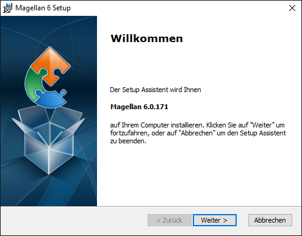

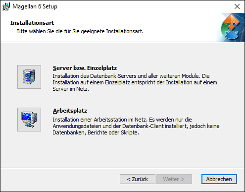

Wählen Sie die gewünschte Installationsart aus:

* _Server:_ Der Datenbank-Server \(Firebird\) und alle weiteren Module werden auf einem Server installiert. Auf diesen befindet sich im Regelfall die MAGELLAN 6 Datenbank. Die einzelnen Arbeitsstationen, welche auf den Server zugreifen, werden mit der Art „Arbeitsplatz“ installiert.

* _Einzelplatz:_ Der Datenbank-Server und alle weiteren Module werden auf einem Rechner installiert. Sie entspricht der Serverinstallation im Netz und wird daher über die gleiche Option ausgewählt.

* _Arbeitsplatz:_ Es wird ein Arbeitsplatz in Netzwerk installiert. Dazu werden nur die Anwendungsdaten und der Datenbank-Client installiert, jedoch nicht Datenbank, Berichte oder Skripte. Eine Arbeitsplatzinstallation setzt eine Serverinstallation voraus. Firebird darf auf diesem Arbeitsplatz nicht installiert sein.

Die weiteren Beschreibungen finden Sie in den nachfolgenden Abschnitten „Serverinstallation“, „Arbeitsplatzinstallation“ und „Einzelplatzinstallation.

> #### danger::Wichtig
>
> Die Installation des Datenbankservers \(Firebird\) wird für die Installationsarten Server und Einzelplatz vorausgesetzt.

## Serverinstallation und Einzelplatzinstallation

Nachdem Sie die Installationsart „Server bzw. Einzelplatz“ gewählt haben, ist der Setup Assistent bereit, die Installation der Dateien vorzunehmen. Die Installation selbst muss direkt auf dem Server oder dem Einzelplatz erfolgen.

Wählen Sie zunächst den Speicherort für die Programmdateien aus.

Wählen Sie den Speicherort für die Datenbank und klicken Sie auf „Weiter“.

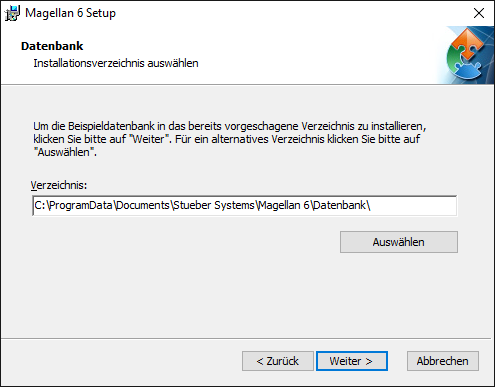

Wählen Sie den Speicherort für die Datenordner \(Berichte-, Dokumente-, Importe-, Skripte- und Vorlagenordner\) und klicken Sie auf „Weiter“.

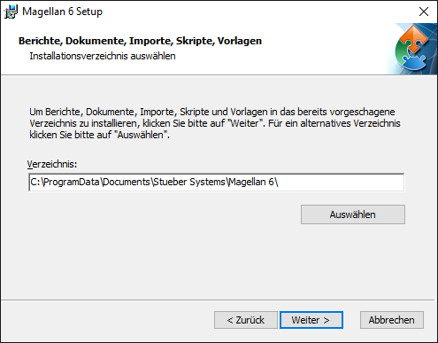

> #### danger::Achtung!
>
> Der Installationsassistent schlägt Ihnen hier Speicherpfade für die Datenordner vor. Diese Pfade können Sie im Assistenten anpassen. Bitte beachten Sie, dass diese Pfade später bei Updates verwendet werden. Sollten Sie hier angelegten Verzeichnisse auf Dateiebene verschieben, können trotz Update aktualisierte Daten fehlen. Sollten Sie sich später umentscheiden, deinstallieren Sie das Programm vom Serverrechner, installieren neu und geben den gewünschten Pfad an.

Klicken Sie nun auf „Installieren“, um mit der Installation zu beginnen.

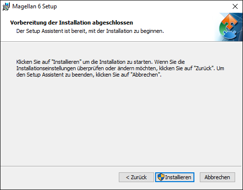

Die Installation selbst kann einige Minuten in Anspruch nehmen. Klicken Sie zum Abschließen der Installation auf „Fertigstellen“.

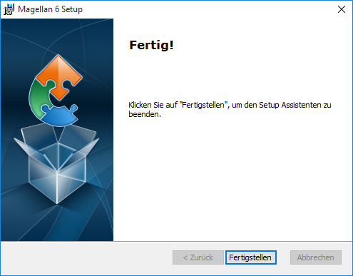

### Speicherorte der Dateien

Nach Abschluss der Installation befinden sich standardmäßig die Dateien in folgenden Ordnern auf dem Server:

Anwendungsdaten \(z.B. Magellan.exe\):

| Betriebssystem | Pfad |
| --- | --- |
| Windows Vista | C:\Program Files\Stueber Systems\Magellan 6 |
| Windows XP | C:\Programme\Stueber Systems\Magellan 6 |
| Windows 2000 | C:\Programme\Stueber Systems\Magellan 6 |
| Windows 7 | C:\Programme\Stueber Systems\Magellan 6 |
| Windows Server 2008 | C:\Program Files \(x86\)\Stueber Systems\Magellan 6\ |
| Windows 8 | C:\Programme\Stueber Systems\Magellan 6 |
| Windows 10 | C:\Program Files \(x86\)\Stueber Systems\Magellan 6\ |

Allgemeine Einstellungs- und Lizenzdaten \(z.B. Magellan.evm, Magellan.lic, Magellan.SiteInfo, Magellan.UserInfo\):

| Betriebssystem | Pfad |
| --- | --- |
| Windows Vista | C:\ProgramData\Stueber Software\Magellan 6 |
| Windows XP | C:\Dokumente und Einstellungen\All Users\Anwendungsdaten\Stueber Software\Magellan 6 |
| Windows 2000 | C:\Dokumente und Einstellungen\All Users\Anwendungsdaten\Stueber Software\Magellan 6 |
| Windows 7 | C:\ProgramData\Stueber Software\Magellan 6 |
| Windows Server 2008 | C:\ProgramData\Stueber Software\Magellan 6 |
| Windows 8 | C:\ProgramData\Stueber Software\Magellan 6 |
| Windows 10 | C:\ProgramData\Stueber Software\Magellan 6 |

Datenordner \(Vorlagen, Skripte, Importe, Dokumente, Berichte, Datenordner\):

| Betriebssystem | Pfad |
| --- | --- |
| Windows Vista | C:\Users\Public\Documents\Stueber Systems\Magellan 6 |
| Windows XP | C:\Dokumente und Einstellungen\All Users\Anwendungsdaten\Stueber Systems\Magellan 6 |
| Windows 2000 | C:\Dokumente und Einstellungen\All Users\Dokumente\Stueber Systems\Magellan 6 |
| Windows 7 | C:\Users\Public\Documents\Stueber Systems\Magellan 6 |
| Windows Server 2008 | C:\ProgramData\Documents\Stueber Systems\Magellan 6 |
| Windows 8 | C:\Users\Public\Documents\Stueber Systems\Magellan 6 |
| Windows 10 | C:\Users\Public\Documents\Stueber Systems\Magellan 6 |

Die Pfade sind exemplarisch für die deutschen Versionen der Betriebssysteme und können je nach Sprache und Ausgabe des Betriebssystems variieren.

## Arbeitsplatzinstallation

Starten Sie die Installation per Doppelklick auf das Installationspaket, wählen Sie im Assitenten bitte den Installationstyp "Arbeitsplatz" aus.
Im Unterschied zur Serverinstallation werden bei der Arbeitsplatzinstallation nur die Anwendungs-, Einstellungs- und Lizenzdaten installiert. Die dafür verwendeten standardmäßigen Ordner entsprechen jenen bei der Serverinstallation.

## Erster Programmstart

Nach Beenden des Setup Assistenten müssen Sie MAGELLAN 6 starten. Es erscheint zunächst der Willkommen-Assistent.

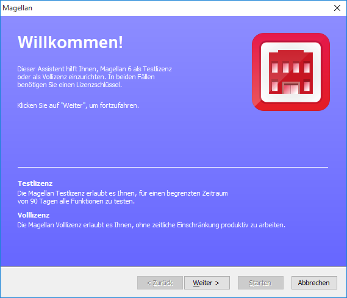

Klicken Sie auf „Weiter“. Um Magellan starten zu können, müssen Sie Ihre Lizenzdaten für eine Vollversion oder eine Testlizenz eingeben.

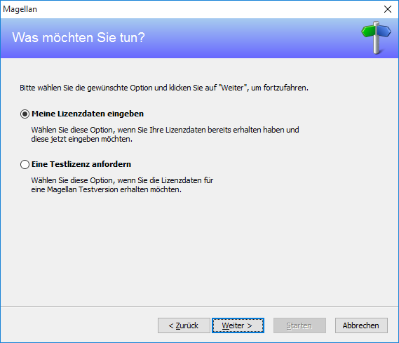

Wählen Sie „Eine Testlizenz anfordern“ und klicken Sie dann auf „Weiter“, wenn Sie noch keine Lizenzdaten besitzen. Die Lizenzdaten können Sie dann mit Hilfe des Assistenten per E-Mail direkt anfordern oder als Textdatei speichern, falls Sie keinen E-Mailzugang besitzen.

Wenn Sie Ihre Lizenzdaten erhalten haben, wählen Sie „Meine Lizenzdaten eingeben“ und klicken Sie dann auf „Weiter“. Tragen Sie nun Ihre Lizenzierung ein. Sollten Sie mit Ihren Lizenzdaten auch eine Lizenzdatei erhalten haben, so können Sie diese alternativ über „Lizenz importieren“ einlesen. Klicken Sie dann auf „Weiter“.

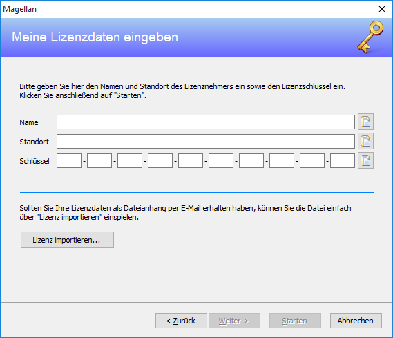

Wählen Sie hier Ihr Bundesland aus und klicken dann auf „Weiter“.

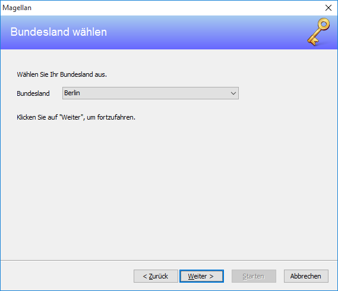

Sie müssen entscheiden, ob Sie mit einer entfernten oder einer lokalen Datenbank arbeiten möchten. Bei einer Server-/Einzelplatzinstallation stellen Sie „Lokale Datenbank“ ein. Bei einer Arbeitsplatzinstallation wählen Sie „Entfernte Datenbank“.

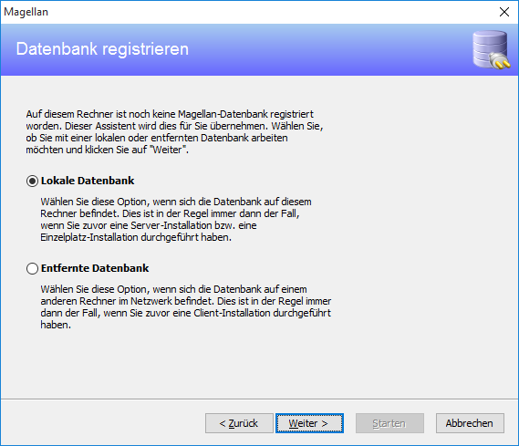

### Entfernte Datenbank

Bei der Auswahl „Entfernte Datenbank“ werden Sie zur Eingabe des Servernamens und des Datenbank-Pfads aufgefordert.

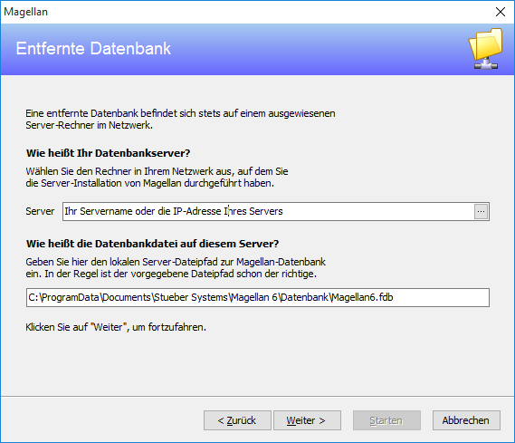

Geben Sie unter „Server“ den Servernamen bzw. die IP-Adresse Ihres Servers ein, auf dem sich die MAGELLAN 6 Datenbank befindet. Im unteren Feld geben Sie den lokalen Serverpfad \(aus Sicht des Servers\) zur MAGELLAN 6 Datenbank an.

Der standardmäßige Pfad zur MAGELLAN 6 Datenbank lautet:

| Betriebssystem | Pfad |
| --- | --- |
| Windows Vista | C:\Users\Public\Documents\Magellan 6\Datenbank\Magellan6.fdb |
| Windows XP | C:\Dokumente und Einstellungen\All Users\Anwendungsdaten\Stueber Software \Magellan 6\Datenbank\Magellan6.fdb |
| Windows 2000 | C:\Dokumente und Einstellungen\All Users\Dokumente\Stueber Software\Magellan 6\Datenbank\Magellan6.fdb |
| Windows 7 | C:\Users\Public\Documents\Stueber Software\Magellan 6\Datenbank\Magellan6.fdb |
| Windows 2003 | C:\ProgramData\Documents\Stueber Software\Magellan 6\Datenbank\Magellan6.fdb |
| Windows 2008 | C:\ProgramData\Documents\Stueber Software\Magellan 6 Datenbank\Magellan6.fdb |

Die Pfade sind exemplarisch für die deutschen Versionen der Betriebssysteme und können je nach Sprache und Ausgabe des Betriebssystems variieren. Wenn Sie die Originaleinstellungen während der Installation beibehalten haben, trifft einer der oben gezeigten Datenbankpfade zu.

### Lokale Datenbank

Direkt auf dem Server oder einem Einzelplatz entscheiden Sie sich bitte für „Lokale Datenbank“. Sie werden dann zur Eingabe des Datenbankpfads aufgefordert.

Der standardmäßige Pfad zur MAGELLAN 6 Datenbank lautet:

| Betriebssystem | Pfad |
| --- | --- |
| Windows Vista | C:\Users\Public\Documents\Magellan 6\Datenbank\Magellan6.fdb |
| Windows XP | C:\Dokumente und Einstellungen\All Users\Anwendungsdaten\Stueber Software\Magellan 6\Datenbank\Magellan6.fdb |
| Windows 2000 | C:\Dokumente und Einstellungen\All Users\Dokumente\Stueber Software\Magellan 6\Datenbank\Magellan6.fdb |
| Windows 7 | C:\Users\Public\Documents\Stueber Software\Magellan 6\Datenbank\Magellan6.fdb |
| Windows Server 2003 | C:\ProgramData\Documents\Stueber Software\Magellan 6\Datenbank\Magellan6.fdb |
| Windows Server 2008 | C:\ProgramData\Documents\Stueber Software\Magellan 6\Datenbank\Magellan6.fdb |

Die Pfade sind exemplarisch für die deutschen Versionen der Betriebssysteme und können je nach Sprache und Ausgabe des Betriebssystems variieren. Wenn Sie die Originaleinstellungen während der Installation beibehalten haben, trifft einer der bei-den oben gezeigten Beispielpfade zu.

Im folgenden Bild werden die Verzeichnisse der Datenordner abgefragt. In der Regel sind die Vorgaben richtig. Hat man die Skripte, Berichte, Dokumente etc. aber an anderer Stelle \(z.B. auf dem Server\) gespeichert, kann man dies hier angeben.

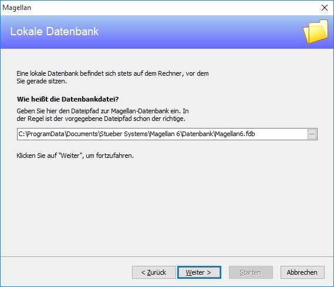

> WICHTIG: Wünschen Sie andere Pfade als die vorgegebenen, stellen Sie es bitte in diesem Assistentenfenster ein. Ein Service-update nutzt immer nur die Pfade, die zum Zeitpunkt der Installation in diesem Fenster angelegt worden sind. Eine nachträg-liche Änderung kann nur mit einer erneuten Installation erfolgen.

Bestätigen Sie mit „Weiter“ und klicken Sie  auf „Starten“, um den Willkommens-Assistenten abzuschließen und MAGELLAN erstmalig zu starten.

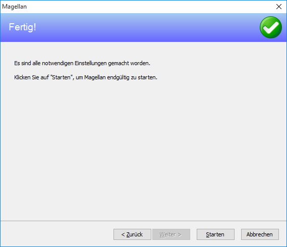

Geben Sie im Anmeldedialog bei Benutzer „sysdba“ und als Kennwort „masterkey“ ein.

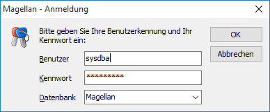

