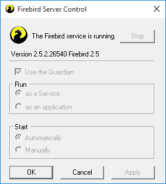
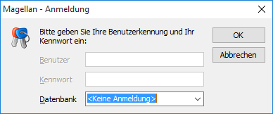
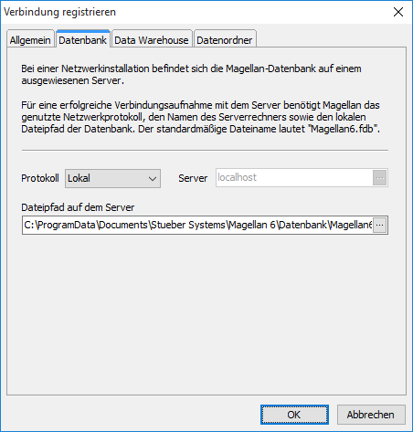

# Probleme bei der Installation?

## Die Erstanmeldung klappt nicht

Folgende Ursachen könnten der Grund sein: MAGELLAN startet auf dem Serverrechner nicht? Ist Firebird auf dem Serverrechner installiert und gestartet? In der Systemsteuerung Ihres Serverrechners finden Sie unter „klassische Ansicht“(oder kleine Symbole) einen Aufruf für den Firebird-Datenbank-Manager. Die Einstellungen sollten wie folgt sein:

 
## Datenbank und Firebird sind auf unterschiedlichen Partitionen installiert

Firebird nutzt für den Datenverkehr den Port 3050, mitunter ist dieser Port durch die Windows Firewall gesperrt. Richten Sie bitte eine Ausnahme (Eingehende und Ausgehende Regel) für diesen Port ein und versuchen es bitte erneut. 

## Der Pfad zur Datenbank ist verkehrt

 Starten Sie den Magellan-Administrator ohne Anmeldung: 

Wählen den Punkt Server-Verwaltung|Verbindung verwalten|Starten|Verbindung markieren|Bearbeiten|Unterkarte „Datenbank“. Bitte prüfen Sie, dass Pfad zur Datenbank korrekt ist (Achtung: nachstehende Abbildung enthält lediglich einen Beispielpfad!) und mit dem Dateinamen der Datenbank endet, wie in der folgenden Abbildung:

 
## MAGELLAN startet auf dem Arbeitsplatzrechner nicht

Eventuell ist auch hier der Pfad zur Datenbank verkehrt. Starten Sie bitte den MAGELLAN-Administrator ohne Anmeldung:

Prüfen Sie bitte, dass für die Arbeitsplatzinstallation der Pfad zur Datenbank 1:1 wie auf dem Serverrechner eingetragen wurde. Der Unterschied in der Verbindung liegt nur in den Feldern „Protokoll“ und „Server“.

Im Feld Protokoll sollte TCP/IP gewählt werden, im Feld Server tragen Sie bitte nur den Namen des Serverrechners oder die IP-Adresse des Serverechners ein.

> #### info::Hinweis
> Firebird nutzt für den Datenverkehr den Port 3050, mitunter ist dieser Port durch die Windows Firewall gesperrt. Richten Sie bitte eine Ausnahme (Eingehende und Ausgehende Regel) für diesen Port ein und versuchen es bitte erneut.
 

