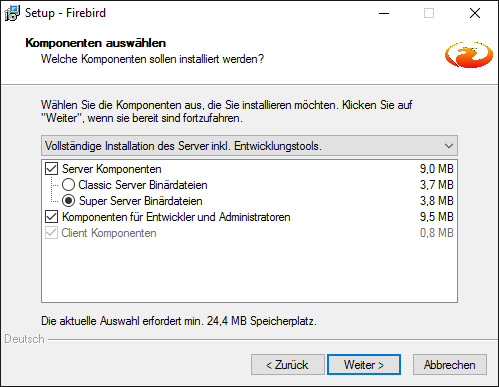
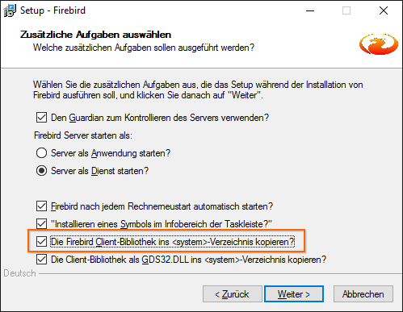

# Umstieg auf eine neue Programmversion

## Update von MAGELLAN 5 auf MAGELLAN 6

Wenn Sie bereits MAGELLAN 5 installiert haben und auf MAGELLAN 6 updaten wollen, müssen Sie in folgenden Schritten vorgehen:

1. In MAGELLAN 5: Zurücksetzen des Administratorenkennwortes auf „masterkey“
2. In MAGELLAN 5: Export der Kennwortdaten
3. Deinstallation von Firebird 1.5
4. Installation von Firebird 2.5
5. Installation von MAGELLAN 6
6. Konvertieren der MAGELLAN 5 Datenbank
7. Wiederherstellen der Kennwortdaten aus MAGELLAN 5
8. Paralleler Betrieb von MAGELLAN 5 und MAGELLAN 6
9. Deinstallation von MAGELLAN 5

### Export der Kennwortdaten aus MAGELLAN 5

Wenn Sie bereits mit MAGELLAN 5 gearbeitet haben, können Sie die im MAGELLAN 5 Administrator angelegten Kennwörter der Benutzer übernehmen. 

Die Kennwörter werden in einer gesonderten Firebird-Datenbank mit dem Namen security.fdb (Firebird 1.5) verschlüsselt gespeichert. Die Datei security.fdb wird bei der Installation von Firebird 1.5 angelegt. Da für Version MAGELLAN 6 auch eine neue Version von Firebird genutzt wird, muss die alte Passwortdatenbank konvertiert werden. Andernfalls müssten Sie für alle Benutzer die Benutzerzugänge neu in MAGELLAN 6 anlegen.

Voraussetzung für den Export der Kennwortdaten ist MAGELLAN 5 ab der Version 5.2.14. Bitte beachten Sie außerdem, dass die Sicherung der Datei ``security.fdb`` nicht unter Windows Vista möglich ist.

Gehen Sie für das Konvertieren bitte folgendermaßen vor:

1. Starten Sie den Magellan 5 Administrator auf Ihrem Server.

2. Wählen Sie bitte Datenbank|Administratorenkennwort, ändern das Passwort auf „masterkey“ und bestätigen mit „OK“.

3. Wählen Sie den Punkt „Benutzerverwaltung“ und kontrollieren die Spalte „Kennung“. Firebird akzeptiert bei der späteren Wiederherstellung keine Kennung mit Umlauten. Sollten Umlaute dabei sein, müssten Sie diese bitte ersetzen.

4. Wählen Sie bitte Datensicherung|Sicherungskopie erstellen aus. Im unteren Feld geben Sie bitte folgenden Pfad und Dateinamen an: ``C:\Programme\Firebird\Firebird_1_5\security.fbk``

5. Bestätigen Sie mit OK.

Die Daten der Datei ``security.fdb`` werden in einer neuen Datei ``security.fbk`` gesichert. In einem weiteren Arbeitsschritt werden nach der Installation von Firebird 2 und MAGELLAN 6 diese Kennwortdaten mit dem neuen MAGELLAN 6 Administrator wieder hergestellt. Diese Beschreibung finden Sie dann im Abschnitt „Wiederherstellen der Kennwortdaten aus MAGELLAN 5“.

> WICHTIG: Es dürfen keine Umlaute in den Benutzerkürzeln vorhanden sein, falls doch bitte ändern. Die Sicherung der ``security.fdb`` kann nicht unter Windows Vista oder späteren Betriebssystemen vorgenommen werden.

### Deinstallation von Firebird 1.5

MAGELLAN 6 setzt mit Firebird 2 eine neuere Version des Datenbank-Management-Systems voraus. Deinstallieren Sie bitte die bisherige Version 1.5 von Firebird. Mit der neuen Version Firebird 2 ist es möglich MAGELLAN 5 und MAGELLAN 6 parallel zu nutzen, allerdings greifen beide Programmversionen nicht auf dieselbe Datenbank zu.

1. Rufen Sie auf dem Server die Systemsteuerung auf (Start | Systemsteuerung)

2. Wählen Sie den Punkt „Software“ (bzw. ab  Windows Vista „Programme und Funktionen“) und markieren den Aufruf „Firebird 1.5“ und wählen Entfernen/Deinstallieren.

Welche Einstellungen Sie für MAGELLAN 5 treffen müssen, um MAGELLAN 5 auch mit Firebird 2 nutzen zu können, finden Sie im Abschnitt „Paralleler Betrieb von MAGELLAN 5 und MAGELLAN 6“. 

### Installation von Firebird 2.5

* Laden Sie bitte das Firebird-Installationspaket von unseren Webseiten oder unter [folgendem Link](https://download.stueber.de/bin/de/firebird/Firebird-2.5.8.27089_0_Win32.exe)

* Starten Sie die Firebird-Installation durch einen Doppelklick auf die Datei ``Firebird-2.5.2.26540_0_Win32.exe``.

* Bitte übernehmen Sie auf der Karte „Komponenten auswählen“ die voreingestellten Optionen.
  
  

* Auf der Karte „Zusätzliche Aufgaben auswählen“ übernehmen Sie bitte die Optionen und aktivieren zusätzlich das Häkchen „Die Firebird Client-Bibliothek ins Systemverzeichnis kopieren“.
  
  
 
> WICHTIG: Firebird wird nur dem Rechner installiert, auf dem die Datenbank gespeichert werden soll. Das kann der Server sein oder auch ein netzwerkunabhängiger Rechner.

### Installation von MAGELLAN 6

Die Installation von MAGELLAN 6 entspricht der Anleitung im obigen Abschnitt „Erstinstallation von MAGELLAN 6“. 

### Konvertieren der MAGELLAN 5 Datenbank

Um Ihre MAGELLAN 5 Datenbank weiterhin in MAGELLAN 6 nutzen zu können, kopieren Sie bitte Ihre MAGELLAN 5 Datenbank (Standardname: Magellan5.fdb) und fügen Sie diese im Datenbank-Pfad Ihrer MAGELLAN 6 Installation ein. Dieser lautet standardmäßig auf Ihrem Server ein:

Betriebssystem      | Pfad
--------------------| -------------
Windows Vista       | C:\Users\Public\Documents\Magellan 6\Datenbank
Windows XP          | C:\Dokumente und Einstellungen\All Users\Anwendungsdaten\Stueber Software\Datenbank
Windows 2000        | C:\Dokumente und Einstellungen\All Users\Dokumente\Stueber Software\Datenbank
Windows 7           | C:\Users\Public\Documents\Stueber Software\Magellan 6\Datenbank
Windows Server2000  | C:\ProgramData\Documents\Stueber Software\Magellan 6\Datenbank

Die Pfade sind exemplarisch für die deutschen Versionen der Betriebssysteme und können je nach Sprache und Ausgabe des Betriebssystems variieren. Weiter geht es wie folgt:

1. Im gleichen Ordner liegt nach der Installation standardmäßig die Beispieldatenbank von MAGELLAN 6 mit der Bezeichnung ``Magellan6.fdb``. Bitte benennen Sie diese Datenbank um, zum Beispiel in ``Magellan6Beispiel.fdb``.

2. Benennen Sie nun Ihre MAGELLAN 5 Datenbank ``Magellan5.fdb`` in Magellan6.fdb um.

3. Beim ersten Start von MAGELLAN 6 wird dann die Datei ``Magellan6.fdb`` mit Hilfe eines Assistenten konvertiert.
 
4. Beim ersten Start von MAGELLAN 6 melden Sie sich bitte als Administrator mit dem Benutzer „sysdba“ und dem Passwort „masterkey“ an. Es startet ein Assistent zur Datenstrukturanpassung.

Der Assistent passt die Datenstruktur der Datenbank an, anschließend öffnet sich MAGELLAN 6.

### Wiederherstellen der Kennwortdaten aus MAGELLAN 5

Damit die Anwender unter MAGELLAN 6 die gleichen Kennwörter nutzen können wie unter MAGELLAN 5, müssen Sie die unter „Export der Kennwortdaten aus MAGELLAN 5“ erstellte Datei security.fbk mit den Kennwörtern aus MAGELLAN 5 unter MAGELLAN 6 einlesen:

> WICHTIG: Das Administratorenkennwort der neuen Magellan6-Installation muss auf „masterkey“ gesetzt bleiben oder wieder zurückgesetzt werden. Sie können diese Einstellung im MAGELLAN 6 Administrator unter "Datenbank | Administratoren-Kennwort" vornehmen. Ihr altes Administratorenkennwort der 5er Datenbank können Sie bei der Konvertierung später mit angeben. 

1. Öffnen Sie auf Ihrem Server den MAGELLAN 6 Administrator mit dem Benutzernamen sysdba und dem Passwort masterkey und wählen Sie „Ansicht|Datenbankpflege“.

2. Wählen Sie „Firebird 1.5 Sicherheitsdatenbank konvertieren“. 

3. Bitte geben Sie in der oberen Zeile (Datenbank) den Speicherort der mit dem MAGELLAN 5 Administrator angelegten Sicherungskopie der Datei ``security.fdb`` an. Standardmäßig wird der Pfad zum Firebird 1.5-Verzeichnis angeboten. Ist an dieser Stelle die erwartete ``security_backup.fbk`` nicht vorhanden, färbt sich der Pfad automatisch rot.

4. In der unteren Zeile (Kennwort) geben Sie bitte masterkey ein. Klicken Sie anschließend auf „Starten“. Der Assistent stellt die Sicherungskopie im neuen Format wieder her und legt die Passwortdatenbank ab unter folgendem Pfad: ``C:\Program Files\Firebird\Firebird_2_5``.

5. Schließen Sie bitte den Administrator nach erfolgter Konvertierung und melden Sie sich bitte anschließend wieder dem Administratorenpasswort „masterkey“ an.

6. Synchronisieren Sie abschließend noch die Zugriffsrechte. Sie finden diesen Aufruf ebenfalls im MAGELLAN 6 Administrator unter "Datenbankpflege | Datenbank überprüfen | Zugriffsrechte synchronisieren".
 
7. Anschließend können Sie das Administratorenpasswort wieder unter "Administrator | Datenbank | Administratoren-Kennwort" abändern. Alle Benutzer können sich wieder mit den gewohnten Zugängen auch unter MAGELLAN 6 anmelden.

### Paralleler Betrieb von MAGELLAN 5 und MAGELLAN 6

Nach der Installation von MAGELLAN 6 kann diese Version auch parallel mit MAGELLAN 5 eingesetzt werden, um beispielweise zunächst im Testbetrieb mit MAGELLAN 6 zu arbeiten. Damit MAGELLAN 5 auch mit Firebird 2 funktionsfähig ist, müssen Sie Ihre Datenbankverbindung(en) im MAGELLAN 5 Administrator eventuell anpassen:

1. Öffnen Sie auf den MAGELLAN 5 Administrator und wählen Sie „Ansicht | Serververwaltung“.

2. Wählen Sie „Verbindung verwalten“

3. Für jede der aufgelisteten Verbindungen führen Sie folgende Kontrolle durch: Markieren Sie die Verbindung und wählen Sie „Bearbeiten“. Überprüfen Sie auf der Registerkarte „Datenbank“ die Einstellung unter Protokoll. Ist unter Protokoll „Lokal“ eingetragen, so ändern Sie bitte die Einstellung in Protokoll „TCP/IP“ und geben unter Server „localhost“ an. Ist unter Protokoll „TCP/IP“ eingetragen, müssen Sie keine Änderung vornehmen