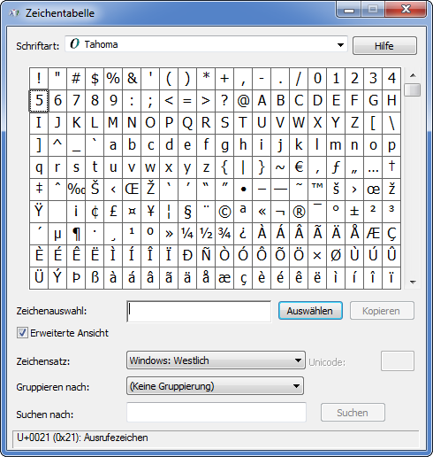

# Sonderzeichen

Dieses Kapitel erläutert die Verwendung von Sonderzeichen  in den Eingabefeldern von Magellan. 

## Zeichensatz

In MAGELLAN wird die Schriftart „Tahoma“ zur Anzeige verwendet. Welche Zeichen und damit auch Sonderzeichen zur Eingabe verwendet werden können, kann dem Windows-Tool Zeichentabelle entnommen werden.

So rufen Sie die Zeichentabelle in Windows auf:

1. Klicken Sie auf `Start > Alle Programme > Zubehör > Systemprogramme > Zeichentabelle`.
 
2. Wählen Sie unter Schriftart "Tahoma" aus.

3. Markieren Sie `Erweiterte Ansicht`.

4. Wählen Sie unter Zeichensatz „Windows: Westlich“ und unter Gruppierung „(keine Gruppierung)“ aus.
 

Im oberen Teil des Dialogfensters Zeichentabelle sehen Sie jetzt alle zur Verfügung stehenden Zeichen.

## Einfügen von Sonderzeichen

Über das Windows-Tool `Zeichentabelle` können Sie leicht Sonderzeichen in ein Eingabefeld von MAGELLAN einfügen. Gehen Sie dazu wie folgt vor:

1. Öffnen Sie das Windows-Tool `Zeichentabelle`, indem Sie auf `Start > Alle Programme > Zubehör > Systemprogramme > Zeichentabelle` klicken.

2. Wählen Sie unter Schriftart "Tahoma" aus.

3. Markieren Sie `Erweiterte Ansicht`.

4. Wählen Sie unter Zeichensatz „Windows: Westlich“ und unter Gruppierung „(keine Gruppierung)“ aus.

5. Wählen Sie im oberen Teil das gewünschte Sonderzeichen durch Markieren und drücken der Schaltfläche `Auswählen` oder durch Doppelklick aus. Es erscheint dann im Feld `Zeichenauswahl`. 

6. Klicken Sie auf die Schaltfläche `Kopieren`, damit das Sonderzeichen in den Zwischenablage von Windows übernommen werden kann.

7. Markieren Sie in MAGELLAN die gewünschte Position für das Sonderzeichen in einem Eingabefeld. Fügen Sie das Sonderzeichen aus dem Zwischenspeicher über die Tastenkombination `Umschalttaste + Einfg` (oder `Strg + V`) ein.
